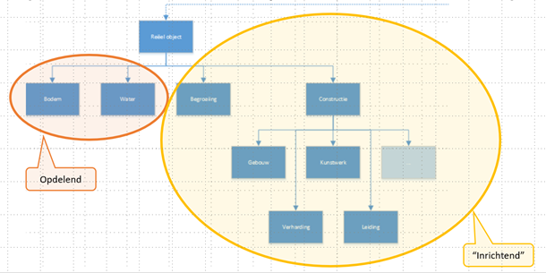
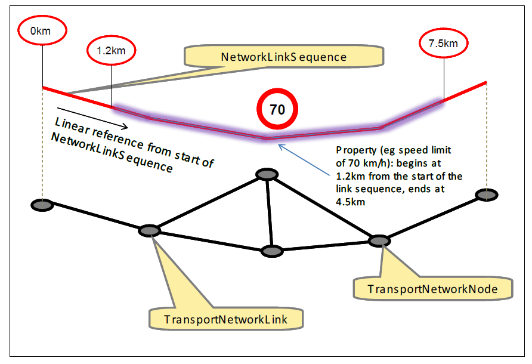
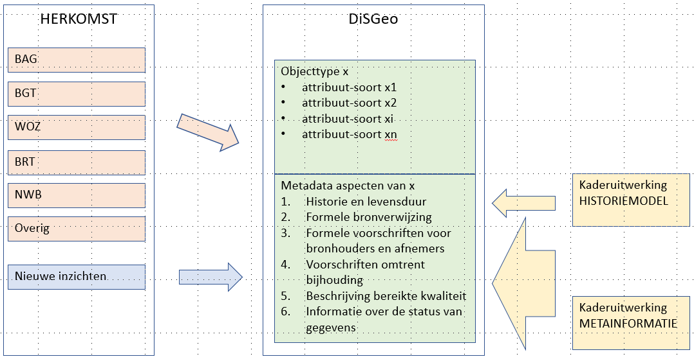

## Generieke onderwerpen

### Identificatie van objecten

**Samenvattend**
Er is behoefte aan een persistente universele unieke en betekenisloze identificatie,  en overal geldige, permanente en unieke verwijzing naar een object, waarmee hierdoor interoperabiliteit wordt gemaximaliseerd  en ook solide koppelingen met andere gegevensverzamelingen mogelijk worden, zowel door de tijd heen en bij toepassing van verschillende geometrische representaties.

#### Opbouw identificatie

Ontwerpprincipe: *De huidige wijze van objectidentificatie van NEN3610 wordt gehanteerd want de SOR conformeert zich aan de NEN3610-norm*

*Doel van NEN3610ID*
Binnen de ‘digitale ruimte’ moeten informatie-objecten uniek identificeerbaar zijn. De object-identificatie (object-id) is de pointer naar het informatie-object. Als men het over het informatie-object met een bepaald object-id heeft (of er naar verwijst) dan wil men zeker weten dat daadwerkelijk dat ene informatie-object wordt bedoeld en niet dat men er meerdere ‘terugkrijgt’. Belangrijk is ook om duidelijk te hebben wat de ‘digitale ruimte’ is. Er wordt mee bedoeld de ruimte waarin digitale objecten gezamenlijk voor kunnen komen. Dus in principe de ruimte waarin je informatie met elkaar uitwisselt of deelt.

NB: In een separaat project zal worden onderzocht of deze wijze van objectidentificatie ook toepasbaar is in een bredere context buiten de SOR en de geo-wereld

Ontwerpprincipe: *De identificatie voor alle objecten is betekenisloos* 

Van belang is dat de objectidentificatie niet betekenisvol geïnterpreteerd mag worden.	

Ontwerpprincipe: *De opbouw voor alle objecten is gelijk*

Voor alle objecten in de SOR wordt dezelfde opbouw en toekenning van een identificatie toegepast.

#### Uniciteit

Ontwerpprincipe: *een identificatie binnen Nederland is volledig uniek*

We willen zeker weten dat we in tijd en ruimte het over hetzelfde object in de SOR hebben. De identificatie moet daarom uniek zijn.

Ontwerpprincipe: *een identificatie wordt mondiaal uniek gemaakt door er de landcode aan toe te voegen*

Conform NEN3610

#### Uitgifte
 
Ontwerpprincipe: *uitgifte van individuele identificaties in de SOR moet dubbele identificaties voorkomen*
Er moet een methodiek worden ontwikkeld om uit te sluiten dat dubbele identificaties worden uitgegeven. Tevens moet er direct op getoetst worden bij de voorbereiding van een uitgifte van een identificatie of deze al bestaat om latere schade te voorkomen.

Ontwerpprincipe: *een identificatie aan een object in de SOR wordt toegekend zodra er voor het eerst in de SOR iets over dit object wordt geregistreerd*

Vanwege de eis van persistentie moet de uitgifte van de objectidentificatie direct worden gedaan bij welke registratie van een gegeven en welk moment in de tijdslijn van een object dan ook.

NB: In het eerder genoemde separate project zal worden onderzocht of de identificatie toch niet eerder moet worden uitgegeven

Ontwerpprincipe: *uitgifte van identificaties vindt niet eerder dan de SOR plaats*

Indien een object in een sectorregistratie mocht ontstaan, dan heeft dat object daar een unieke sectorregistratie-identificatie. Er is dan nog geen sprake van meervoudig gebruik buiten de sector. Als het object vervolgend wordt aangeboden aan de SOR, wordt dan pas en niet eerder een SOR-objectidentificatie uitgegeven. De oorspronkelijke sector registreert vervolgens deze SOR-objectidentificatie waarmee de interoperabiliteit is geborgd.

#### Hanteerbaarheid
 
Ontwerpprincipe: *een objectidentificatie in de SOR is machineleesbaar bedoeld en niet mensleesbaar*

De objectidentificatie van de SOR is bedoeld om in het kader van interoperabiliteit te gebruiken bij het volledig geautomatiseerd relaties bevragen tussen verschillende datasets.

#### Implementatie-vrij

Ontwerpprincipe: *Een objectidentificatie van de SOR kent een functionele versie*

De SOR kent een functionele objectidentificatie.  De functionele objectidentificatie is systeem (implementatie) onafhankelijk. 

Ontwerpprincipe: *een functionele objectidentificatie kan een of meer technische identificaties hebben*

De technische objectidentificatie is de toepassing van de functionele identificatie in een technische omgeving. In de technische uitwerking kunnen aan de functionele identificatie een of meer technische identificaties worden gerelateerd die eenduidig met die ene functionele identificatie verbonden zijn, bijvoorbeeld GML,API of URI.
Objecten geïmplementeerd in verschillende technische omgevingen moeten middels hun functionele identificatie aan elkaar te relateren zijn. Bijvoorbeeld: een object dat zowel in XML als in JSON als in LD is geïmplementeerd moet herkenbaar zijn als voorkomens van eenzelfde object.

#### Persistent in de tijd

Ontwerpprincipe: *Een objectidentificatie mag niet veranderen in de levensloop van het object zodat tijdreizen maximaal wordt gefaciliteerd*

De identificatie van een object in de SOR moet persistent zijn over de levensloop van dat object, zodat altijd duidelijk is welk object het betreft, ook als het object inmiddels is gesloopt

#### Filiatie (afkomst/overgang)

Ontwerpprincipe: *Het moet mogelijk zijn om de afkomst van een object na te gaan door de relatie vast te leggen met het object/ de objecten waaruit een object is ontstaan*

Dit is bedoeld om tijdreizen optimaal te ondersteunen. Objecten kunnen zijn ontstaan door samenvoeging of splitsing van andere objecten. Op een bepaald moment in de tijd bestond het specifieke object wellicht nog niet, maar wel een voorouder van dit object.

Ontwerpprincipe: *Het moet mogelijk zijn om de overgang van een object na te gaan door de relatie vast te leggen met het object/ de objecten waarin een object is overgegaan*

Dit is bedoeld om tijdreizen optimaal te ondersteunen. Objecten kunnen zijn overgegaan in andere objecten door samenvoeging of splitsing. Op een bepaald moment in de tijd bestaat het specifieke object wellicht niet meer, maar wel mogelijk een afstammeling van dit object.

#### Samenhang

Ontwerpprincipe: *samenhang faciliteren van de koppeling tussen sectorale identificaties (interne ID) en de SOR-objectidentificatie (externe ID)*

Sectorregistraties kennen vaak hun eigen identificatie. Er zal gefaciliteerd moeten worden dat bij de objecten in de sectorregistraties de SOR-identificaties van de SOR-objecten worden vastgelegd.
De informatie die in de sector opgeslagen is daarmee te ontsluiten op basis van de SOR-objectidentificatie

Ontwerpprincipe: *samenhang faciliteren van huidige basisregistratie-identificaties en de objectidentificatie van de SOR*

De objecten in de huidige basisregistraties hebben een verplichte unieke identificatie, die in veel aanpalende sectorregistraties wordt gebruikt. Gedurende een nader te bepalen (transitie-)periode zal de samenhang moeten worden bijgehouden tussen de identificatie van de SOR en die van de objecten waaruit SOR-objecten zijn ontstaan.

#### Levensloop

Ontwerpprincipe: *De levensloop begint in de samenhangende objectenregistratie*

Zodra een basisobject is benoemd zal dit worden doorgegeven aan de SOR met de bijbehorende kenmerken omdat het een basisobject is en de kennis daarover gelijk breed beschikbaar moet zijn. 

NB: In het eerder genoemde separate project zal dit nader worden onderzocht 

ontwerpprincipe: *de levensloop eindigt in de samenhangende objectenregistratie*

Zodra een basisobject is beëindigd zal dit worden vastgelegd in de SORmet de bijbehorende kenmerken omdat het een basisobject is en de kennis daarover gelijk breed beschikbaar moet zijn.
dit moet in afbakeningsregels goed worden uitgewerkt,

#### Reikwijdte
 
Ontwerpprincipe: *Het gebruik van objectidentificaties van de SOR is verplicht binnen de overheid*

Om integraal gebruik van gegevens over meerdere gegevensverzamelingen heen (interoperabiliteit) maximaal te faciliteren is het noodzakelijk dat de identificaties van de SOR-objecten als verbindende sleutel verplicht worden gebruikt in de sectorregistraties die op die objecten aansluiten. 

Ontwerpprincipe: *Er wordt toezicht gehouden op het gebruik van objectidentificaties van de SOR binnen de registraties van de overheid*

Hierbij is het ook noodzakelijk dat er een toezichthouder wordt ingesteld die bewaakt en periodiek audits uitvoert of deze verplichting wel maximaal wordt nageleefd.

Ontwerpprincipe: *Het gebruik van objectidentificaties wordt binnen het private domein gestimuleerd*

Om integraal gebruik van gegevens over meerdere gegevensverzamelingen heen maximaal te faciliteren wordt het gestimuleerd dat de identificaties van de SOR-objecten als verbindende sleutel worden gebruikt in de private registraties die op die objecten aansluiten en die al dan niet open data zijn. 
Dit zou bijvoorbeeld via een afsprakenstelsel geregeld kunnen worden

### Geometrie

#### Coördinatenstelsel

####  3D
ontwerpprincipe: **de SOR moet 3D-voorbereid zijn. Dit betekent dat 2D verplicht is en 3D vrijwillig.** Van elk objecttype in de SOR wordt minimaal als eigenschap vastgelegd wat het geometrisch voorkomen is van een object in de registratie conform hetgeen daarover voor het betreffende objecttype is bepaald, waarbij de vastlegging hiervan zodanig wordt vormgegeven dat de driedimensionale (3D) beschrijving van een object kan worden opgenomen.

*hier uitschrijven welke levels of details worden onderscheiden in de SOR voor 3D*

*let op: ook de z-hoogte is van belang naast volume, zoals bij bv fly-overs, etc, etc.*

    In de SOR gaan we naar een driedimensionale beschrijving van objecten. Dit vraag om een herziening van huidige topologie regels en het begrip maaiveld. Wij zijn opzoek naar mensen die een zinvolle bijdrage kunnen leveren op dit onderwerp.

#### Geometrie-type

| Waarde Type | Beschrijving   |
|---|---|
|punt | |
|lijn ||
|vlak ||
|volume||
|1.5D| punt met Z-coördinaat|
|2.5D| vlak met Z-coördinaat|
|3D| volume met Z-coördinaat|

#### Topologie

Opdelende objecttypen en referentielaag (100%)

**NEN3610**
De Samenhangend objectenregistratie conformeert zich aan NEN3610. 
NEN3610 
- Richt zich op taxonomie
- Richt zich NIET op topologieregels
- Heeft het dus ook niet over ‘opdelend’ of ‘inrichtend’ of over een referentielaag als het maaiveld

**Topologie**

ontwerpprincipe: *Het semantisch model van de SOR conformeert zich aan NEN3610*

ontwerpprincipe: *Nen3610 doet geen uitspraken over topologie, voor de SOR van DisGeo gelden wel topologische regels*

ontwerpprincipe: *Er is sprake van een Referentielaag op het Nederlandse Grondgebied ten opzichte waarvan andere objecten kunnen worden gepositioneerd. Deze laag werd voorheen als ‘maaiveld’ aangeduid. Maar deze term is niet scherp genoeg omdat deze vanuit verschillende thema’s anders wordt bekeken.*

Deze Referentielaag wordt 
- In geval van fysieke objecttypen volledig gedekt door objecten uit de objecttypen BODEM en WATER.
   -	Hierbij sluiten de objecten topologisch naadloos op elkaar aan
   - 	Objecten van andere fysieke objecttypen worden ten opzichte hiervan gepositioneerd, zoals bijvoorbeeld Gebouwen en Verharding.   Ook de 3D-verschijningsvormen van objecten kunnen ten opzichte hiervan worden gepositioneerd
   -	Door deze werkwijze wordt de complexiteit van de topologie sterk gereduceerd ten opzichte van de huidige situatie in de BGT
- In geval van functionele objecttypen NIET volledig gedekt omdat daar geen noodzaak voor is.

ontwerpprincipe: *In geval van nadere benoemde registratieve objecttypen is er sprake van een topologisch aaneengesloten situatie die echter niet het totale nederlandse grondgebied hoeft te bedekken*
- Voorbeeld: de gemeentelijke indeling van Nederland is een topologisch aaneengesloten verzameling van objecten die zich echter niet uitstrekt tot het continentale plat.

### Netwerken

In de samenhangende objectenregistratie worden vier transportnetwerken onderscheiden: wegen, spoor, water en scheepvaart. Netwerken zijn een verdere uitwerking van de virtuele objecten transportvoorzieningen in het basismodel NEN3610. En zijn in de SOR opgenomen om functionele eigenschappen te kunnen registreren en om als basis kunnen dienen voor routeringsvraagstukken.

De structuur van een netwerk kenmerkt zich door knopen en verbindingen. De wijze van beschrijven van de structuur is voor alle netwerken hetzelfde. In generieke zin zouden alle netwerken als één geheel kunnen worden beschreven. De netwerken zijn immers ook onderling verbonden. Echter de inhoud verschilt dermate dat het vanuit beheer- en bruikbaarheid praktischer is om de netwerk los van elkaar te beschrijven.

Voor meer detail wordt verwezen naar het conceptueel model netwerken. LINK??

#### Locatie

Ontwerpprincipe: 

**Een netwerk ligt op het fysieke object waar het bij hoort.**

#### Eigenschappen
Ontwerpprincipe: 

**Eigenschappen van verbindingen die niet voor de hele verbinding gelden worden vastgelegd met lineair referencing.**

Eigenschappen kunnen meerdere malen van waarde wisselen langs een verbinding. Bijvoorbeeld als de straatnaam wijzigt bij het passeren van de gemeente- of woonplaatsgrens. Of als de snelheid op een provinciale weg vlak voor het verkeerslicht wordt teruggebracht naar 50 km/h. Als er geen dringende reden is om de structuur van het netwerk te verstoren door verbindingen verder op te knippen, worden de eigenschappen bij een verbinding vastgelegd met de methode van lineair referencing . Dit is dus een methode waarbij administratief wordt aangegeven bij een verbinding waar een verandering geldt.

<aside class='example'>

VOORBEELD Van 1200 meter tot 4500 meter vanaf het beginpunt van de verbinding geldt een toegestane snelheid van 70 km/h.
</aside>

#### Onderlinge relaties
Ontwerpprincipe: 

**Relaties tussen netwerken en functionele zones via hyperverbinding.**

Ontwerpprincipe: 

**Relaties tussen netwerken of  bij verschillende LoD van een netwerk worden vastgelegd met een hyperverbinding.**

#### Detaillering

Ontwerpprincipe: 

**Detaillering waar nodig**

### Mate van detail (schaal niveau)

*Vermijd schaalloos*

 De term ‘schaalloos’ niet gebruiken; Inwinning is nooit schaalloos, en vindt plaats op het hoogste detailniveau van een object en moet zodanig zijn dat het passend is bij het beoogde gebruik. 

*Van hoog naar laag detailniveau*
Aandachtspunt hierbij is dat het vervolgens mogelijk moet zijn om het geschikt te maken voor beoogd gebruik op lagere detailniveaus met een consistente geïntegreerde lijn door alle detailniveaus (voorheen schaalniveaus) heen. 

*Van laag naar hoog detailniveau*
We streven niet na dat we objecten op een laag detailniveau kunnen terugleiden tot objecten op het hoogste detailniveau. Er is ook geen zinvol gebruik voor gevonden en daarmee geen doel.

*Precisie*
Het gaat bij inwinning om de precisie waarmee een geometrie van een object wordt vastgelegd. Per objecttype moet de norm van deze precisie worden bepaald. Het hoogste detailniveau kan voor sommige objecten, en dit komt vooral voor bij gebieden, op een ander detailniveau zijn dan de meeste andere objecten.

*Brede blik hanteren*
Het DisGeo-concept en daarmee de Samenhangende Objectenregistratie (SOR) kijkt breder dan de BRT.  In de oplossing moeten we ruimte bieden voor toekomstige ontwikkelingen die we nu niet kunnen voorzien hoe lastig dat ook is.  Bijvoorbeeld de huidige corona-analyses wisten we ook niet van tevoren.  Wellicht lopen we in de informatiemodellering ook tegen strijdige belangen aan. Hier moeten we mee om kunnen gaan en mogelijk varianten toe staan

**Begrippen**
- ‘Cartografisch object’ 
Een object wat voor een visualisatie wordt aangemaakt en in dat kader een tijdelijk karakter heeft, wat verbonden is met die specifieke versie van die visualisatie hoe lang die visualisatie ook beschikbaar is

Onder generaliseren wordt verstaan:
- Het zinvol vereenvoudigen 
- verplaatsen 
- ‘opblazen’ van de geometrie van objecten.
Onder aggregeren wordt verstaan: 
- Het samenvoegen van objecten tot een nieuw object (zowel op dataniveau als cartografisch niveau). Aggregeren kan dus daarmee ook een aspect van generaliseren zijn. 

Nadere verdieping: https://www.researchgate.net/publication/259639775_A_typology_of_operators_for_maintaining_legible_map_designs_at_multiple_scales

**Ontwerpprincipes**

Ontwerpprincipe: *objecttypen ENKEL EN ALLEEN op het voor de SOR meest gedetailleerde noodzakelijke niveau vast leggen (de kleinste semantische eenheden)*

Ontwerpprincipe: *geaggregeerde dataobjecttypen NIET opnemen in de SOR*

Ontwerpprincipe: *cartografische objecttypen als onderdeel van de producten van DisGeo opnemen*

Ontwerpprincipe: *de kwaliteit van de objecten en de bijbehorende gegevens zó  borgen 
dat geautomatiseerde generalisatie probleemloos kan verlopen*

Ontwerpprincipe: *sectormodellen moeten gebruik maken van de dataobjecten uit de SOR*

In het kader van BRT / Top10 NL is een onderzoeksvraag in het huidige generalisatie proces gestreld: is het wenselijk om geaggregeerde dataobjecten met universele unieke persistente identificaties te hebben?  De uitkomst hiervan was dat dit niet het geval bleek te zijn en is daarom niet geïmplementeerd (niet door de kaartschalen heen en niet door de tijd heen).
Uit Gebruikers-consultaties bleek dat klanten maken geen gebruik van afgeleide kaartschalen voor data-analyses, hooguit voor aanpassen van visualisatie en symbologie en hooguit voor een eenmalige actie waarbij de identificatie niet nodig is.
Daarmee 
1.	Is er geen informatiebehoefte aan geaggregeerde data-objecttypen
2.	Zijn cartografische objecttypen voldoende zonder (complexe) afstemmingsrelaties
3.	Is er ook geen behoefte aan unieke universele persistente identificatie van geaggregeerde objecten

**Onderbouwing**
*Generaliseren*
Het zinvol vereenvoudigen (en andere operatoren) van de geometrie van objecten 
Alternatieven:
1.	Een object in de Samenhangende ObjectenRegistratie heeft alleen geometrieën op basisniveau (punt, lijn, vlak en/of volume)
1.	Een object moet daarnaast in de SOR ook geometrieën hebben op een aantal benoemde schaalniveaus 
1.	Een object mag daarnaast in de SOR ook geometrieën hebben op een aantal benoemde schaalniveaus  

Een combinatie van 1 en 3 heeft de voorkeur.
1.	Dit is voor de data het enige relevante alternatief. 
1.	We kiezen voor een positieve insteek en daarmee NIET voor dit alternatief. Als we dit toelaten om daarmee een verkeerd gebruik te voorkomen heeft dit en negatieve lading en dat is ongewenst.
1.	Dit is alleen gewenst alleen bij cartografische producten, niet bij de data.

**Aggregeren**
Het samenvoegen van objecten tot een nieuw object
Alternatieven:

1.	De Samenhangende ObjectenRegistratie heeft alléén DATAobjecten op basisniveau 
1.	In de SOR mogen daarnaast ook geaggregeerde CARTOGRAFISCHE objecten 
    1.	Wel of niet voorkomen met een eigen identificatie 
    1.	niet voorkomen met eigen levensloop
    1.	niet voorkomen met een aantoonbare relatie naar de basisobjecten waaruit ze zijn ontstaan
    1.	Wel voorkomen met geometrieën op een aantal benoemde schaalniveaus boven 1:1.000

Een combinatie van a en d heeft de voorkeur.

We kiezen voor optie 1 en 2, want: 1 moet en 2 mag 
1.	Dit is voor de data het enige relevante alternatief. 
1.	Voor cartografische objecten geldt 
   1.	Er mag een eigen tijdelijke identificatie aan worden toegevoegd zodat de gebruiker daar mee verder kan. Deze identificatie wordt echter niet bewaard.
   1.	Omdat de identificatie niet wordt bewaard is een eigen levensloop niet aan de orde
   1.	Omdat de identificatie niet wordt bewaard is een relatie naar de basisobjecten waaruit ze zijn ontstaan ook niet aan de orde. Dit ligt in lijn met de stelling dat we niet van een laag naar een hoog detailniveau teruggaan.
   1.	Als het wenselijk is kunnen ten dienste van gebruikers in de producten geometrieën op een lager detailniveau worden aangeboden die gebaseerd zijn op geometrieën van onderliggende basisobjecten op een hoger detailniveau
 

**Terugmeldingen op gegeneraliseerde objecten**

Alternatieven:
1.	Er kunnen geen terugmeldingen meer zijn op de gegeneraliseerde cartografische objecten, want:
    1.	Ze hebben geen persistente eigen identificatie
1.	Er kunnen wel terugmeldingen meer zijn op de gegeneraliseerde cartografische objecten, maar:
    1.	Deze werken niet door op onderliggende dataobjecten
    1.	Deze werken door op ALLE dataobjecten waar ze uit zijn ontstaan 
let op: Wil je dat als bv een terugmelding wordt gedaan op een cartografisch object op 1:1.000.000 dit dan doorwerkt op álle dataobjecten die daar in liggen op het laagste schaalniveau en daar individueel behandeld moeten worden.? 
   1.	Deze werken door op ‘het belangrijkste dataobject’ waar ze uit zijn ontstaan
   1.	Deze werken niet door en moeten altijd eerst beoordeeld worden waarbij geconstateed wordt dat 
        1. Of de terugmelding de aggregatie betreft en niet doorgezet hoeft te worden naar de bronhouders vasn de onderliggende data
        1.	Of de terugmelding de data betreft en wordt toegewezen aan geselecteerde betrokken dataobjecten uit de SOR

We kiezen voor optie 2.4 en afhankelijk van de situatie daarbinnen voor stap a of b, want een eindgebruiker zie de producten en moet op basis daarvan ene terugmelding kunnen doen. Deze kan niet 1 op 1 worden doorgezet naar alle onderliggende dataobjecten op het hoogste detailniveau, want dat is mogelijk helemaal niet aan de orde en dan zouden objecten op het hoogste detailniveau onnodig belast worden met terugmeldingen. Een beoordeling door een behandelaar of door artificiële intelligentie is daarom een belangrijke tussenstap. 

**Kwaliteit**

-	Dataobjecten moeten op het basisniveau landelijk uniform en homogeen en aaneensluitend zijn 
-	Dit moet nader uitgewerkt worden in de informatiemodellering en in de eisen aan de inwinningsregels. Er moet hiervoor één consistent systeem voor zijn en ook de implementatie moet consistent zijn
-	Objecten op verschillende relatieve hoogteniveaus moeten goed op elkaar aansluiten waar ze elkaar raken

### Meta-informatie en bronverwijzing

    Het is wenselijk dat de onderstaande teksten iets verder worden toegespitst op een zelfstandig beschrijving die aansluit op de wijze waarop andere zaken zijn beschreven. Daarbij kan het plaatje waarschijnlijk vervallen (is meer intern gericht). Meta-informatie over objecttypen en attribuuttypen moeten (uiteindelijk) een plaats krijgen in de beschrijvingen in hoofdstuk 5 -7. De inhoud hoeft nu nog niet gevuld te worden (zoals inhoudelijke kwaliteitseisen). Meta-informatie per object of attribuut is de nadere invulling van het blokje “overige metagegevens" bij de in hoofdstuk 5-7 beschreven objecttypen en attribuuttypen. In paragraaf 5.4.1 is een voorbeeld opgenomen. We bespreken in de werkgroep inhoud hoe we hier tegenaan kijken.

Deze paragraaf beschrijft de uniformering van metagegevens in de SOR. 

**WAAROM leggen we meta-informatie vast over de gegevens die zijn opgenomen in de SOR**
•	Zonder meta-informatie:
•	Géén grip op zorgvuldig gebruik
•	Géén vertrouwen
•	Verhoogd risico op herhalen van een onderzoek, nodeloos werk, verkeerde interpretatie, verkeerde toepassing, onterechte meldingen
•	Het geeft inzicht in:
•	Waar een gegeven vandaan komt
•	Interpretatie
•	Bruikbaarheid
•	Kwaliteit, nauwkeurigheid, actualiteit, status, bron/herkomst, inwinningsmethode (incl bronverwijzing),
•	Voor beheer: Welke controles moeten worden gedaan en zijn gedaan

**Waar leggen we meta-informatie van vast en waarom**
1.	Per objecttype, want er zijn eisen die voor het gehele objecttype gelden, zoals eisen aan de volledigheid van de populatie
2.	Per attribuuttype van een objecttype, want er zijn eisen die altijd voor dat attribuuttype gelden, zoals de controlefrequentie van de geregistreerde objecttypering
3.	Per object, want we willen inzicht in de toestand van een individueel object
4.	Per attribuut van een object, want  we willen inzicht in de toestand (kwaliteit, actualiteit, etc.) van een bepaald attribuut van een individueel object 

**“Gegevenscatalogus”**
Meta-informatie op het niveau van objecttype en attribuuttype leggen we in de huidige situatie in de “gegevenscatalogus” vast. Deze metagegevens zijn in de huidige situaties voor de meeste (basis)registraties moeilijk integraal te bevragen in combinatie met de data zelf. 

Ontwerpprincipe: *De metagegevens per objecttype en per attribuuttype vormen een integraal onderdeel van de SOR. zodat deze net zo toegankelijk zijn als de gegevensverzameling zelf en er virtueel één geheel mee vormen, zodat bijvoorbeeld de kwaliteit van de data soepel en geautomatiseerd zonder extra handelingen met de normkwaliteit kan worden vergeleken.

**Aandachtspunten**
•	Zo veel mogelijk vermijden van het opstellen van een brondocument uitsluitend als metagegeven voor de registratie. Brondocumenten die om andere reden bestaan, worden gebruikt als metagegeven. Verdere aspecten van bronverwijzing worden direct in de registratie als metagegeven opgeslagen zonder de formalisering als "brondocument".
•	Metagegevens worden bij voorkeur geautomatiseerd vastgelegd. Leveranciers worden gestimuleerd om in de functionaliteit voor bijhouding en controle van de SOR hier expliciet tools voor aan te bieden.
•	Metagegevens hebben indien mogelijk een defaultwaarde, die vanuit de applicatie automatisch gevuld, zodat alleen door de bronhouder expliciet een gegeven hoeft te worden geregistreerd als wordt afgeweken van deze defaultwaarde.

#### Meta-informatie per objecttype

Per objecttype worden de volgende metagegevens vastgelegd:

|Aspect   |Beschrijving   | Waarom |
|---|---|---|
|Bronverwijzing   |Eis tav brondocument of andere soort bronverwijzing   | Helder vastleggen of voor het opvoeren (of wijzigen) van een object wel of niet een formeel brondocument vereist is. In andere gevallen kan volstaan worden met bijvoorbeeld een verwijzing naar een luchtfoto of een andere wijze van "constatering"  |
|Gegevenseigenaar   |Vastleggen bronhouder(s)   |Bronhouders is partij die objecten kan opvoeren en afvoeren. Meestal één (categorie) per organisatie, bijvoorbeeld gemeenten of waterschappen  |
|   |Vastleggen openbaarheid gebruik   |Als default zijn alle objecttypen in de SOR openbaar   |
|Kwaliteitseisen   |Beschrijving populatie  |Om helder te maken dat bijvoorbeeld niet alle gebouwtjes in de SOR worden opgenomen   |
|   |Minimale activiteiten gericht op periodieke volledigheidscontrole   |   |
| Kwaliteit  |n.v.t op niveau objecttype   |   |
| Status  |n.v.t op niveau objecttype   |   |

#### Meta-informatie per attribuuttype

Per attribuuttype worden de volgende metagegevens vastgelegd:

| Aspect  |Beschrijving     |Waarom|
|---|---|---|
|Bronverwijzing|Eis tav brondocument of andere bronverwijzing|Helder vastleggen of voor het wijzigen van dit attribuut wel of niet een formeel brondocument vereist is. Er kan ook sprake zijn van een (verplichte) verwijzing naar bijvoorbeeld een luchtfoto of een plaatsbepalingspunt. Tenminste zal vastgelegd moeten worden op basis van welke activiteit het attribuut is geregistreerd of gewijzigd|
|Gegevenseigenaar|Vastleggen bronhouder(s)|Meestal zal dat bronhouder voor een bepaald object(type) ook de bronhouder van de attributen zijn. Het is ook mogelijk dat een andere "bronhouder" wordt aangewezen voor een bepaald attribuut. Als bronhouder wordt de verantwoordelijke instantie vastgelegd. De daadwerkelijk inwinning bijhouding kan mogelijk worden opgedragen (gemandateerd) aan een andere instantie|
|   |Vastleggen openbaarheid gebruik  |Als default zijn alle attribuuttypen in de SOR openbaar   |
|Kwaliteitseisen|Vastleggen of attribuut verplicht is of optioneel|De SOR biedt de mogelijkheden om sommige attributen optioneel op te nemen (als een attribuut wordt opgenomen moet de voldoen aan definities en kwaliteitseisen)|
|   |Beschrijving minimale eisen aan de kwaliteit (precisie, actualiteit)|Vergelijk de eis aan de nauwkeurigheid van de gebruiksoppervlakte in de BAG. Eis kan ook zijn dat een object binnen enkele dagen/maanden na realisatie beschikbaar moet zijn in de BAG. |
|   |Eisen aan de wijze van inwinning van het attribuut|Bijvoorbeeld de eis dat de geometrie op basis van luchtfoto ingewonnen moet worden|
|   |Minimale inspanningsverplichtingen om attribuut op orde te houden.|Bijvoorbeeld de eis dat tenminste eenmaal per vijf jaar de juistheid van de objecttypering gecontroleerd moet worden   |
|Kwaliteit|n.v.t op niveau attribuuttype|   |
|Status|n.v.t op niveau attribuuttype|   |

#### Meta-informatie per object

Per object worden de volgende metagegevens vastgelegd:

| Aspect  |Beschrijving     |Waarom|
|---|---|---|
|Bronverwijzing |Verwijzing naar bron|Dit kan verwijzing zijn naar formeel document (zoals een vergunning), een luchtfoto, maar ook een activiteit die geleid heeft tot opname/wijziging van dit object|
|Gegevenseigenaar|Vastleggen bronhouder |Exacte aanduiding wie bronhouder is (welke gemeente bijvoorbeeld) is van belang voor autorisatie tot wijziging, maar ook voor routering van terugmeldingen|
|   |Vastleggen openbaarheid gebruik|Als default zijn alle objecten in de SOR openbaar toegankelijk|
|Kwaliteitseisen|n.v.t  op niveau individueel object|   |
|Kwaliteit|Beschrijving wijze van inwinning|   |
|   |Beschrijving wijze (gebruikte bronnen) meest recente controle, moment controle en uitvoerder|Vastlegging van controle zijn zowel voor gebruikers als voor de bronhouder zelf van belang|
|Status|inOnderzoek, InBewerking maar ook *onderzocht*|Omdat de aanduiding inOnderzoek is gekoppeld aan een terugmelding is er behoefte aan een parallelle status ingeval de bronhouder zelf activiteiten rond deze registratie heeft gestart. Wanneer onderzoek niet heeft geleid tot wijziging, is het belangrijk dat dit ook herkenbaar is. Valt mogelijk samen met vastlegging (laatste) controle (kwaliteit) |
|   |Aantekenveld|Mogelijkheid voor beheerders onderling om informatie uit te wisselen  |

#### Meta-informatie per attribuut van een object

Per attribuut worden de volgende metagegevens vastgelegd:

| Aspect  |Beschrijving     |Waarom|
|---|---|---|
|Bronverwijzing   |Verwijzing naar bron|Dit kan verwijzing zijn naar formeel document (zoals een vergunning), een luchtfoto, maar ook een activiteit die geleid heeft tot opname/wijziging van dit attribuut|
|Gegevenseigenaar|Vastleggen bronhouder|Exacte aanduiding wie bronhouder is (welke gemeente bijvoorbeeld). Is in de regel voor alle attributen van een object gelijk|
|   |Vastleggen openbaarheid gebruik|Als default zijn alle attributen in de SOR openbaar toegankelijk|
|Kwaliteitseisen|n.v.t  op niveau individueel attribuut|   |
|Kwaliteit|Beschrijving wijze van inwinning|   |
|   |Beschrijving wijze (gebruikte bronnen) meest recente controle, moment controle en uitvoerder|Vastlegging van controle zijn zowel voor gebruikers als voor de bronhouder zelf van belang|
|Status|inOnderzoek, InBewerking|zie onder metagegevens object|
|   |aantekenveld|zie onder metagegevens object|

#### Plaatsbepalingspunten

    Het is wenselijk dat de onderstaande teksten iets verder worden toegespitst op een zelfstandig beschrijving die aansluit op de wijze waarop andere zaken zijn beschreven. Ook moet dit nog vertaald worden in een concreet voorstel rondom plaatsbepalingspunten. In de werkgroep inhoud moeten we hier mogelijk nog een proces voor afspreken.

Ook in de SOR zullen plaatsbepalingspunten een rol gaan spelen als bron. Plaatsbepalingspunten  (PBP’s) zoals die nu in de BGT als bronverwijzing bedoeld zijn, zijn immers ook een type meta-informatie (bronverwijzing) bij een specifiek object (attribuut geometrie).  Daarvoor is het wel nodig dat in de SOR bij het specifieke object/attribuut de administratieve relatie naar die bron expliciet wordt vastgelegd net zoals bij een verwijzing naar een document. Alleen dan kan sprake zijn van een beheersbare vorm van metagegevens.
Het zorgvuldig omgaan met PBP's als onderdeel van de metagegevens is nodig: 
- Voor gebruikers is dan expliciet bekend welk(e) PBP(’s) bij welk object hoort.
- PBP’s die niet meer tot de actuele objecten behoren kunnen worden bepaald en in downloads zonder historie worden geschrapt.
- Conform gegevenscatalogus BGT 1.2: Alleen voor objecten die goed idealiseerbaar zijn in het terrein worden voor de coördinaten die zijn ingemeten middels inwinningsmethoden fotogrammetrisch, terrestrisch, laserscanning of panoramabeelden, plaatsbepalingspunten opgenomen. De goed idealiseerbare objecten zijn de objecten met een positionele nauwkeurigheid van tenminste 30 centimeter.
- De ligging van elk BGT-object is gedefinieerd door geometrie. Deze geometrie is expliciet gekoppeld aan een BGT-object in de vorm van een attribuut ‘geometrie’. Deze geometrie moet overeenkomen met de geometrie van plaatsbepalingspunten van de goed idealiseerbare objecten, die deel uitmaken van de verzameling van de meetkundige afbakening.
- Op maaiveldniveau vormen de verbindingen tussen de coördinaten altijd een grens tussen twee aangrenzende objecten in de BGT. Uitzonderingen op deze regel zijn de punten die de geometrie van een spoor en in specifieke gevallen van een lijnvormige scheiding definiëren. De specifieke gevallen treden alleen dan op als een lijnvormige scheiding in zijn geheel binnen een vlakobject ligt en met maximaal een punt raakt aan de begrenzing van dat vlakobject.

**Eisen aan plaatsbepalingspunten**

- Plaatsbepalingspunten (PBP’s) zijn die punten die in coördinaten bekend zijn en die gebruikt zijn bij en onderdeel uitmaken van de begrenzing van BGT-objecten. Elk plaatsbepalingspunt heeft een unieke identificatie . In de SOR moet (anders dan op dit moment in de BGT) in voorkomende gevallen een administratieve koppeling plaats vinden van de geometrie van een object naar de desbetreffende PBP's op basis van het ID.
- Van elke plaatsbepalingspunt is de nauwkeurigheid, de inwinningsdatum, de inwinnende instantie die het heeft bepaald en de inwinningsmethode bekend. 

**Aandachtspunten voor vastleggen meta-informatie in de SOR**

- Meta-informatie makkelijk kunnen registreren met ondersteuning vanuit de systemen, zodat het bijvoorbeeld eenvoudig is om metagegevens over te nemen naar andere objecten (bijvoorbeeld alle gebouwen binnen een luchtfoto de status "gecontroleerd" te geven,
- Zo effectief en efficiënt mogelijk (en daarmee voor belangrijk deel geautomatiseerd) metadata vastleggen 
- Niet onnodig muteren (met name van geometrie) – alleen het relevante object muteren en niet de aangrenzende objecten in de omgeving allemaal gelijk ook muteren. Het zorgdragen van consistentie van de geometrie is iets voor de producten. Hoe dit het best kan worden opgelost, wordt nog verschillend over gedacht.
- Zoveel mogelijk als kan werken met domeintabellen in de metadata. Voorbeeld bij inwinning kunnen kiezen uit b.v. terrestrisch, digitalisering, constructie. fotokartering. Dit geldt ook voor "wijze van controle".
- De ervaring uit de BAG leert dat het opvoeren van brondocumenten een zeer tijdrovende bezigheid is met de vraag of het heeft voldaan aan haar doel. Daarom wordt alleen met formele brondocumenten gewerkt als deze om andere reden al bestaan (zoals vergunningen). In andere gevallen wordt gebruik van bijvoorbeeld luchtfoto of PBP als bronverwijzing, dan wel een beschrijving van de herkomst van het gegeven. Dan kan volstaan worden met de aanduiding dat het object geconstateerd is in het veld, zonder de verplicht om een "proces verbaal van constatering" op te maken.

### Historie

#### Uitgangspunten voor historiemodel 
Het globaal semantisch historiemodel voor de samenhangende objectenregistratie is gebaseerd op de volgende uitgangspunten:
-	zo eenvoudig mogelijk. Dus geen registratie en bijhouding van data die niet strikt noodzakelijk zijn voor het beoogde tijdreizen, voor doelmatig beheer door de bronhouder en voor consistentiecontrole op elk willekeurig moment in de tijd. Zo eenvoudig mogelijk betekent ook zo gestandaardiseerd mogelijk. Het model moet geschikt zijn voor alle verschillende objecttypen die binnen de SOR een plek kunnen krijgen en bij voorkeur ook voor andere (basis)registraties. Maximaal aansluiten op bestaande standaarden en ervaringen hoort hier dus ook bij;
-	een eenduidig model. Dat wil zeggen voor alle attributen binnen de Samenhangende objectenregistratie hetzelfde model en dus geen onderscheid tussen geometrie en administratieve gegevens;
-	Stevige basis gelegen in een internationaal perspectief in combinatie met geldende Nederlandse standaarden. Dus zoveel mogelijk conform internationaal breed omarmde uitgangspunten en best practices, die ook teruggevonden worden in bestaande Nederlandse standaarden. Vanuit deze basis is het historiemodel gebaseerd op twee tijdlijnen (tijdlijn geldigheid en tijdlijn registratie);
-	tijdreizen in het verleden en in de toekomst. Voor het vastleggen van tijdlijnen in de toekomst wordt dezelfde systematiek gebruikt als voor tijdlijnen in het verleden. Natuurlijk is deze werkwijze alleen mogelijk wanneer tijdlijnen in de toekomst relatief eenvoudig bijgesteld kunnen worden. Natuurlijk kent alleen de tijdlijn geldigheid data in de toekomst. De tijdlijn registratie is gebaseerd op het moment van registreren en deze wordt in beginsel bepaald door de computerklok;
-	maximale ondersteuning door techniek. De bronhouder moet weinig inspanningen hoeven te doen om de tijdlijnen vast te leggen. Dat hangt deels samen met bepaalde definities (beginGeldigheid van geometrie gemeten in een luchtfoto zal gelijk zijn aan de datum waarop de foto gemaakt is, zonder verplichting tot nader onderzoek, wanneer de werkelijke beginGeldigheid niet blijkt uit andere processen). Ook de te bieden functionaliteit om te bewaken of toekomstmutaties niet ten onrechte in de registratie de actualiteit worden door het voortschrijden van de tijd, is daarbij een belangrijke randvoorwaarde.

#### Beschrijving historiemodel  
Het globaal semantisch historiemodel laat zich het best beschrijven vanuit het perspectief van de gebruiker/afnemer. Het model geeft daarmee aan op welke wijze de gebruiker met de gegevens in de SOR een tijdreis kan maken

##### Tijdlijn geldigheid en tijdlijn registratie
Het historiemodelis gebaseerd op twee tijdlijnen, namelijk de tijdlijn geldigheid en de tijdlijn registratie. Daarmee adviseren de experts om de in Nederlandse standaarden veel gebruikte benamingen voor de twee tijdlijnen (materiële en formele historie) niet te gebruiken, omdat tijdens het onderzoek dat aan dit advies ten grondslag ligt, is gebleken dat de begrippen materiële en formele historie in verschillende standaarden en verschillende praktijktoepassingen anders gedefinieerd en toegepast worden.
Hoewel de benaming van de gebruikte tijdlijnen daarmee afwijkt van de bestaande standaarden en praktijktoepassingen zullen de voor deze tijdlijnen gebruikte attributen wel door iedereen worden herkend. Dit zijn voor de tijdlijn geldigheid beginGeldigheid en eindGeldigheid (aangevuld met ingangsdatumObject en einddatumObject voor de bestaansperiode (levensduur) van het object).
Voor de tijdlijn registratie is dit het attribuut tijdstipRegistratie. tijdstipRegistratie betreft de tijdstempel die door de computerklok wordt geplaats op het moment dat het desbetreffende gegeven (attribuut) beschikbaar wordt gesteld voor de gebruiker.

De tijdlijn registratie geldt hierbij als aanvulling op de tijdlijn geldigheid. Met andere woorden er zijn geen attributen waarvoor wel de tijdlijn registratie wordt bijgehouden, maar niet de tijdlijn geldigheid.

##### BeginGeldigheid voor ingewonnen geometrie uit bijvoorbeeld luchtfoto's
Deze keuze betekent een wijziging voor de basisregistraties met hoofdzakelijk geometrie (BGT en BRT), maar deze keuze is noodzakelijk om een eenduidig historiemodel te kunnen hanteren binnen de gehele samenhangende objectenregistratie. Maar door de wijze waarop de tijdlijn geldigheid wordt toegepast zal deze omschakeling niet veel consequenties hebben. Bijvoorbeeld geometrie die volledig wordt ontleend aan een opname (bijvoorbeeld luchtfoto) zal als beginGeldigheid (tijdlijn geldigheid) de datum van de luchtfoto krijgen, omdat de feitelijke ingangsdatum niet nauwkeuriger kan worden ingeschat. Wanneer de uit dezelfde foto gemeten geometrie echter betrekking heeft op de contouren van een gebouw, dan zal de beginGeldigheid van de geometrie gelijk zijn aan de beginGeldigheid van de overige attributen van dat gebouw "bij ingebruikname". 

##### Toekomstmutaties
BeginGeldigheid en ook eindGeldigheid kunnen in de toekomst liggen. Hierop gelden geen formele beperkingen. Natuurlijk is van de aard van de gebeurtenis afhankelijk of inderdaad een toekomstmutatie voorzien kan worden en met welke nauwkeurigheid deze voorzien kan worden. Wanneer iemand een bouwvergunning krijgt, kan voorzien worden dat dit object in de toekomst ook geregistreerd zal worden. De datum vanaf wanneer daadwerkelijk sprake zal zijn van een "bestaand object" kan echter niet exact voorzien worden. Een inschatting van deze datum zal de basis vormen voor de tijdlijn geldigheid in de toekomst. Een besluit om met ingang van een bepaalde datum een straatnaam te wijzigen kan wel met een exacte in de toekomst gelegen datum worden geregistreerd. Wij gaan ervan uit dat er adequate voorzieningen worden gerealiseerd die bronhouders ondersteunen om te voorkomen dat voorziene wijzigingen in de toekomst ineens als de bestaande realiteit worden gezien, uitsluitend door verloop van de tijd.
Deze voorziening kan bijvoorbeeld bestaan uit een overzicht van de wijzigingen die in de loop van de komende week/maand de "actuele" situatie gaan worden, omdat de geregistreerde beginGeldigheid ligt in die periode van een week/maand. De bronhouder kan dan of de geregistreerde beginGeldigheid naar verder in de toekomst schuiven op basis van een nadere inschatting van het moment van realiseren of kan constateren dat inderdaad in die periode sprake is van een zodanige wijziging in de "werkelijkheid" dat de geregistreerde "toekomstmutatie" inderdaad in die periode de "werkelijkheid" wordt.

Bij de registratie zijn toekomstmutaties mogelijk, maar dit is niet "de regel". Veel mutaties in de SOR worden aangebracht op basis van "constateringen" en deze worden dan dus vastgelegd met een beginGeldigheid in het verleden, bijvoorbeeld de datum van de luchtfoto waaraan de constatering wordt ontleend.

##### Levensduur; IngangsdatumObject en einddatumObject
Hoewel het vastleggen van de levensduur van een object (ingangsdatumObject en einddatumObject) redundant is, omdat deze levensduur altijd afgeleid kan worden uit de tijdlijn geldigheid, wordt in het historiemodel er vanuit gegaan dat de levensduur afzonderlijk wordt geregistreerd. De ingangsdatumObject zal gelijk zijn aan de oudste beginGeldigheid voor een status "bestaand/geldig" van het betreffende object. Een gebruiker kan deze ingangsdatumObject eventueel zelf afleiden uit de tijdlijn geldigheid, maar er wordt voor gekozen om, parallel aan de registratie van geboortedatum en overlijdensdatum bij personen, de ingangsdatumObject en einddatumObject wel afzonderlijk in de registratie (of in ieder geval in de informatieproducten) op te nemen.

##### Toepassing per attribuut/objecttype
Het hierboven geschetste model wprdt verplicht  voor alle onderdelen van de SOR. Afnemers kunnen daarbij per attribuut informatie krijgen over beide tijdlijnen. Dit is volgens het historiemodel in samenhang met het voor de SOR op te stellen informatiemodel in beginsel beperkt tot die attributen waarvoor in het informatiemodel wordt vastgelegd dat zij voorzien worden van een tijdlijn geldigheid of van een tijdlijn geldigheid plus tijdlijn registratie. Het aanduiden van het relevant zijn van deze tijdlijnen kan in het informatiemodel, wanneer dat conform het Metamodel voor informatiemodellen (MIM 1.1) wordt opgesteld (Binnen het MIM 1.1 worden nog wel de begrippen materiële en formele historie gebruikt).

Er zou bijvoorbeeld afgezien kunnen worden van het vastleggen van deze tijdlijnen, wanneer geen enkele gebruiker nu of in de toekomst behoefte heeft aan deze tijdlijnen voor het desbetreffende attribuut. Een voorbeeld hiervan zou kunnen zijn de toegang tot een verblijfsobject. Dit kenmerk van een verblijfsobject is vooral van belang om hulpdiensten te ondersteunen bij het zo snel mogelijk binnenkomen van een verblijfsobject. Dit is uitsluitend relevant in de actuele situatie. Het in de SOR opnemen van een tijdlijn voor het attribuut toegang is daarom mogelijk niet relevant is, omdat geen enkele afnemer geïnteresseerd is in het feit dat in het verleden de toegang tot dit verblijfsobject elders was. Aan de andere kant kan ook de principiële keuze gemaakt worden dat gegevens in een basisregistratie "niet weggegooid worden". Dat uitgangspunt zou betekenen dat voor alle attributen in de SOR zowel de tijdlijn geldigheid als de tijdlijn registratie verplicht zouden zijn.

Tijdlijnen per attribuut gelden daarbij op semantisch niveau en moeten beschikbaar zijn in de informatieproducten voor gebruikers. Dit model geeft geen richtlijnen over de wijze waarop dit uiteindelijk in de registratie geïmplementeerd gaat worden.
Informatie

Net als in het informatiemodel per attribuut kan worden vastgelegd of en zo ja welke historie geregistreerd wordt, wordt in het informatiemodel ook gedefinieerd of voor een bepaald objecttype de levensduur (ingangsdatumObject en einddatumObject) wordt vastgelegd. Ook hier hanteren we het uitgangspunt dat in beginsel voor alle objecttypen deze ingangsdatumObject en einddatumObject relevant zijn.

<aside class='example'>
*Nieuwbouwwoning*
Op 1 juli 2020 wordt een bouwvergunning verleend voor een nieuwbouwwoning. Deze wordt direct geregistreerd met alle relevante kenmerken (type woning, gebruiksdoel, gebruiksoppervlakte, bouwjaar, (voorlopige) geometrie).
Verwacht wordt dat de woning per 1 juli 2021 in gebruik genomen zal worden.
Alle kenmerken van deze woning worden geregistreerd met beginGeldigheid 1-7-2020 en tijdstipRegistratie (de computer timestamp op 3-7-2020, wanneer de gegevens worden ingevoerd). De status "vergunning verleend" krijgt naast de beginGeldigheid 1-7-2020 direct een eindGeldigheid 1-7-2021. Met beginGeldigheid 1-7-2021 wordt namelijk de status "in gebruik" geregistreerd.

Op 1 april 2021 constateert de afdeling VTH dat er (eindelijk) begonnen is met de bouw. Dit wordt direct opgenomen in de registratie. Dat betekent dat de status "vergunning verleend" als eindGeldigheid 1-4-2021 krijgt en er een status "in aanbouw" wordt toegevoegd met beginGeldigheid 1-4-2021. Omdat er sprake moet zijn van een consistente tijdlijn zou deze status dan eindGeldigheid 1-7-2021 moeten krijgen om aan te sluiten op de beginGeldigheid van de status "in gebruik". Omdat het onwaarschijnlijk is dat de bouw binnen drie maanden gereed is, krijgt de status "in aanbouw" als einddatum 1-12-2021 en wordt ook beginGeldigheid voor de status "in gebruik" gecorrigeerd naar deze datum.
Op 23-11-2021 geeft het systeem een melding of het klopt dat binnen een week deze woning in gebruik genomen gaat worden. De afdeling VTH constateert dat de woning nog niet gereed is en dat het nog zeker twee maanden gaat duren voordat de woning in gebruik genomen kan worden. De eindGeldigheid voor "in aanbouw" en beginGeldigheid voor "in gebruik" wordt verschoven naar 1-2-2022. Hiermee is voor de afdeling WOZ/Belastingen gelijk helder dat sprake is van een woning in aanbouw op 1 januari.

Op 27-1-2022 ontvangt de gemeente een melding dat de woning gereed is. Voor de laatste maal wordt eindGeldigheid voor "in aanbouw" en beginGeldigheid voor "in gebruik" gecorrigeerd.

Op 15-2-2022 worden er luchtfoto's gevlogen die in maart worden uitgewerkt. De gemeente ontleent hieraan de definitieve geometrie van de woning. Deze wordt geregistreerd met beginGeldigheid 27-1-2022, omdat dit ook de datum is waarop de woning de status "in gebruik" heeft gekregen. (De vanuit dezelfde foto ingewonnen geometrie van de singel voor deze woning krijgt als beginGeldigheid 15-2-2022, de datum van de foto.)

</aside>

#### Levensfasen 

##### Beschrijving levensfasen

 Om het tijdreizen voor alle gebruikers begrijpelijk en ook flexibel te maken, wordt in de samenhangende objectenregistratie ook gewerkt met levensfasen (statussen) van objecten. Dit heeft te maken met het feit dat bij het tijdreizen in de registratie niet alle gebruikers dezelfde wensen hebben. Bij bijvoorbeeld het raadplegen van de "actuele" situatie in het kader van calamiteiten is alleen relevant wat er ook daadwerkelijk aan objecten aanwezig is (inclusief objecten "in aanbouw" of "aanleg in uitvoering"). Maar bij vergunningverlening zal men ook willen zien voor welke objecten inmiddels een vergunning is verleend of anderszins in planning zijn.

Objecten kunnen zich in verschillende fasen van ontwikkeling bevinden. Zo’n fase van ontwikkeling van een object duiden we aan met het begrip levensfase. De verschillende levensfasen van een object tezamen vormen de levenscyclus van een object. Welke levensfasen worden onderscheiden is afhankelijk van het specifieke objecttype. In de samenhangende objectenregistratie komen vier soorten objecttypen voor: fysieke objecttypen, functionele objecttypen, registratieve objecttypen en geografische objecttypen. Elk van deze soorten objecttypen kent dezelfde indeling in hoofdfasen en meestal dezelfde indeling in levensfasen.

Registratieve objecttypen ontstaan als gevolg van besluitvorming. De levenscyclus van registratieve objecttypen bestaat uit twee levensfasen:

- 	Benoemd:		het object is afgebakend op basis van wet- of regelgeving
- 	Ingetrokken:	het object is ingetrokken op basis van wet- of regelgeving
of
- 	Ten onrechte:	het object is ten onrechte in de registratie opgenomen

Bij geografische objecttypen wordt eveneens een onderscheid gemaakt naar twee levensfasen:

- 	Aangewezen:	het object wordt als zodanig onderscheiden
- 	Beëindigd:	het object wordt niet langer als zodanig onderscheiden
of
-  Ten onrechte:	het object is ten onrechte in de registratie opgenomen

Bij fysieke objecttypen worden drie hoofdfasen onderscheiden waarbinnen meerdere levensfasen kunnen voorkomen. De te onderscheiden hoofdfasen zijn: planfase, aanwezigheidsfase en afwezigheidsfase. Welke levensfasen concreet worden onderscheiden is afhankelijk van het specifieke objecttype. Voor een vergunningplichtig bouwwerk zijn andere (meer) levensfasen van belang dan bijvoorbeeld voor een landschapselement. In het algemeen zullen voor niet-vergunningplichtige (veelal eenvoudigere) objecten en vergunningplichtige (veelal complexere) objecten de volgende aan het fysiek bestaan van objecten gerelateerde levensfasen voorkomen:

|Hoofdfase	|Niet-vergunningplichtig	|Vergunningplichtig|
|---|---|---|
|Planfase	|Gepland	|Gepland|
|||	Bouwvergunning verleend|
|||Sloopvergunning verleend|
|Aanwezigheidsfase	|Bestaand |In aanbouw|
|||Bestaand|
|||	In verbouw|
|Afwezigheidsfase	|Verwijderd	|Gesloopt|
||Niet gerealiseerd	|Niet gerealiseerd|
||Ten onrechte	|Ten onrechte|

De bij de levensfasen voor niet-vergunningplichtige objecttypen behorende toelichtingen zijn:

|Waarde status|	Beschrijving|
|---|---|
|Gepland|	Een object dat zich in de ontwerpfase bevindt|
|Bestaand	|Een object dat in gebruik is genomen of als gebruiksgereed kan worden beschouwd|
|Verwijderd|	Een object dat feitelijk is verwijderd|
|Niet gerealiseerd|	Een gepland object dat niet als zodanig is gerealiseerd|
|Ten onrechte|	Een object dat ten onrechte is opgevoerd in de registratie| 

De bij de levensfasen voor vergunningplichtige objecttypen behorende toelichtingen zijn:

|Waarde status	|Beschrijving|
|---|---|
|Gepland|	Een object dat zich in de ontwerpfase bevindt en waarvoor nog geen vergunning tot bouw of aanleg is verleend|
|Bouwvergunning verleend|	Een object dat nog niet is gebouwd of aangelegd maar waarvoor wel een vergunning tot bouw of aanleg is verleend|
|Sloopvergunning verleend|	Een object waarvoor een vergunning tot sloop of verwijdering is verleend|
|In aanbouw|	Een object waarvan de feitelijke bouw of aanleg is aangevangen|
|Bestaand|	Een object dat in gebruik is genomen of als gebruiksgereed kan worden beschouwd|
|In verbouw|	Een object waarvoor een vergunning tot verbouw of wijziging is verleend en waarbij de verbouwing of wijziging nog niet is voltooid|
|Gesloopt|	Een object waarvan de feitelijke sloop of verwijdering is afgerond|
|Niet gerealiseerd|	Een object waarvoor een bouw- of aanlegvergunning was verleend, maar waarvan is vastgesteld dat wordt afgezien van de bouw of aanleg of waarvan de vergunning is ingetrokken|
|Ten onrechte|	Object is ten onrechte opgevoerd in de registratie|

Bij functionele objecttypen zijn de levensfasen van een object meer verbonden aan het gebruik ervan. Ook hier worden in het algemeen de drie genoemde hoofdfasen onderscheiden, waarbij de te onderscheiden levensfasen afhankelijk zijn van het specifieke objecttype. In het algemeen zullen de komende levensfasen voorkomen:

|Hoofdfase	|Transportvoorziening	|Functionele indeling|
|---|---|---|
|Planfase	|Gepland	|Gepland|
|Aanwezigheidsfase	|Gesloten	|Gevormd|
||In gebruik|	In gebruik|
||Ontoegankelijk	|Buiten gebruik|
|Afwezigheidsfase	|Opgeheven	|Beëindigd|
||Niet gerealiseerd	|Niet gerealiseerd|
||	Ten onrechte	|Ten onrechte|

De hierbij behorende toelichtingen voor de levensfasen van transportvoorzieningen zijn:

|Waarde status	|Beschrijving|
|---|---|
|Gepland	|Een object dat zich in de ontwerpfase bevindt|
|Gesloten	|Een object dat is gerealiseerd maar nog niet in gebruik is genomen|
|In gebruik|	Een object dat in gebruik is genomen |
|Ontoegankelijk|	Een object dat in gebruik is genomen maar tijdelijk niet gebruikt kan worden|
|Opgeheven|	Een object dat buiten gebruik is gesteld|
|Niet gerealiseerd|	Een gepland object dat niet als zodanig is gerealiseerd|
|Ten onrechte	|Een object dat ten onrechte is opgevoerd in de registratie|

De bij functionele indelingen behorende toelichtingen voor de levensfasen zijn:

|Waarde status|	Beschrijving|
|---|---|
|Gepland	|Een object dat zich in de ontwerpfase bevindt|
|Gevormd	|Een object dat is gevormd|
|In gebruik	|Een object dat in gebruik is genomen |
|Buiten gebruik|	Een object dat buiten gebruik is gesteld|
|Beëindigd|	Een object dat is opgeheven|
|Niet gerealiseerd|	Een gepland object dat niet als zodanig is gerealiseerd|
|Ten onrechte|	Een object dat ten onrechte is opgevoerd in de registratie|

De levensfase van een object wordt in de registratie vastgelegd als de eigenschap “status” van het object.
De verbetering (inmeten) van geometrie van een object wordt ten opzichte van bestaande basisregistraties niet langer opgevat als een statusverandering maar als een kwaliteitsverandering. Deze laatste wordt geregistreerd door de opname van meta-informatie.

##### Twee levensfasen op hetzelfde moment
In de regel zal een object op enig moment in de tijd zich bevinden in één levensfase. Wanneer met de bouw van een woning wordt gestart, gaat het object over van de levensfase (status) "vergunning verleend" naar de fase "in aanbouw". Dat sluit allemaal aan bij het werken met een eenduidige tijdlijn geldigheid.

In deze tijdlijn geldigheid kunnen ook toekomstmutaties worden geregistreerd. Bij het registreren van een bouwvergunning kan ook gelijk worden geregistreerd op welk moment in de toekomst deze woning bijvoorbeeld de fase "in gebruik" zal bereiken (dat komt overeen met de werkwijze dat nu in de BAG op het moment van registratie van de vergunning ook het bouwjaar wordt geregistreerd).

Het slechts kunnen registreren van één levensfase (samenhangend met de kenmerken van het object die behoren bij die levensfase) op enig moment op de tijdlijn geldigheid knelt echter wanneer er sprake is van een bestaand object (levensfase bestaand/geldig), waarbij ook sprake is van een planfase voor bijvoorbeeld een verbouwing.

Dit kan worden geïllustreerd aan de hand van het voorbeeld van een school die momenteel als school in gebruik is, maar die na het lopende schooljaar verbouwd zal worden tot een woning. Wanneer in de loop van het schooljaar de bouwvergunning wordt verleend voor deze verbouwing, dan wordt volgens het huidige historiemodel van de BAG direct de registratie aangepast. Raadplegen van de actualiteit levert dan op dat sprake is van een woning, terwijl de situatie "in gebruik" nog betrekking heeft op een school met leerlingen.
Toepassing van deze aanpak zou kunnen betekenen dat we de beoogde verbouwing niet registreren met beginGeldigheid het moment van verstrekken van de vergunning, maar met het verwachte moment van verbouwing (bijvoorbeeld aanstaande september). Bij die werkwijze kunnen we echter nog niet vastleggen dat op dit moment al sprake is van een verleende vergunning, terwijl je dat wel zou doen, wanneer sprake zou zijn van een nieuwbouwwoning.

    Hieronder is een eerste voorstel oplossing van dit vraagstuk opgenomen. In de review wordt iedereen uitgenodigd beargumenteerd aan te geven in hoeverre het genoemde voorstel al dan niet een goede oplossing is. Ook wordt iedereen van harte uitgenodigd om alternatieve oplossingen aan te dragen.

Daarom moet het in dit soort situaties (voor een "in gebruik" zijnde gebouw is een vergunning verleend voor verbouw, voor een "in gebruik" zijnde weg bestaat het plan voor uitbreiding) door het informatiemodel voor de SOR gefaciliteerd worden dat een tweede object (bijvoorbeeld gebouw of verblijfsobject of wegvak) wordt geregistreerd. Deze werkwijze komt overeen met de huidige werkwijze voor plantopografie binnen IMGeo. Dit nieuw object wordt wel gerelateerd aan het bestaande object waarop het plan betrekking heeft (en vice versa). De registratie van dit tweede object geschiedt verder alsof sprake is van een nieuwbouwsituatie. Echter zodra dit object gericht op een verbouwing ook daadwerkelijk de fase bestaand/geldig bereikt, wordt het nieuw opgevoerde object "beëindigd" en wordt de feitelijk situatie weer opgenomen in de tijdlijn geldigheid van het oorspronkelijke object dat vanaf dat moment daadwerkelijk "in verbouw" is.

