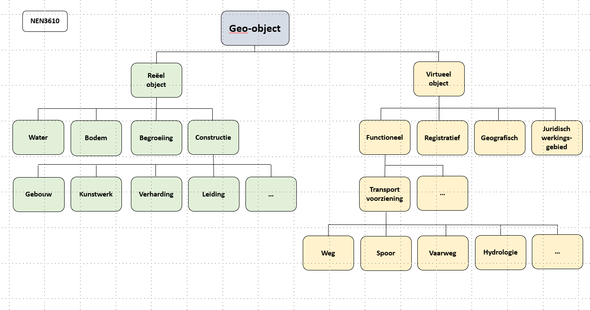
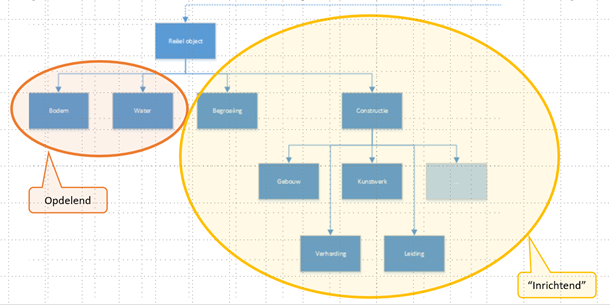

## Kaderuitwerkingen

### Bronverwijzing

### Grondgebied NL

### Mate van detail (schaal niveau)
Analyse van de vraagstukken die samenhangen met een schaalloze wijze van inwinning (kwaliteitseisen kunnen een andere mate van detail kennen dan de detaillering waarmee gegevens in een schaalloze registratie worden opgenomen) en een eerste vertaling hiervan naar kwaliteitseisen;

**Aanscherping door experts**

*Vermijd schaalloos*

Er wordt sterk geadviseerd om de term ‘schaalloos’ niet gebruiken; Inwinning is nooit schaalloos, en vindt plaats op het hoogste detailniveau van een object en moet zodanig zijn dat het passend is bij het beoogde gebruik. 

*Van hoog naar laag detailniveau*
Aandachtspunt hierbij is dat het vervolgens mogelijk moet zijn om het geschikt te maken voor beoogd gebruik op lagere detailniveaus met een consistente geïntegreerde lijn door alle detailniveaus (voorheen schaalniveaus) heen. 

*Van laag naar hoog detailniveau*
We streven niet na dat we objecten op een laag detailniveau kunnen terugleiden tot objecten op het hoogste detailniveau. Er is ook geen zinvol gebruik voor gevonden en daarmee geen doel.

*Precisie*
Het gaat bij inwinning om de precisie waarmee een geometrie van een object wordt vastgelegd. Per objecttype moet de norm van deze precisie worden bepaald. Het hoogste detailniveau kan voor sommige objecten, en dit komt vooral voor bij gebieden, op een ander detailniveau zijn dan de meeste andere objecten.

*Brede blik hanteren*
Het DisGeo-concept en daarmee de Samenhangende Objectenregistratie (SOR) kijkt breder dan de BRT.  In de oplossing moeten we ruimte bieden voor toekomstige ontwikkelingen die we nu niet kunnen voorzien hoe lastig dat ook is.  Bijvoorbeeld de huidige corona-analyses wisten we ook niet van tevoren.  Wellicht lopen we in de informatiemodellering ook tegen strijdige belangen aan. Hier moeten we mee om kunnen gaan en mogelijk varianten toe staan

**Begrippen**
- ‘Cartografisch object’ 
Een object wat voor een visualisatie wordt aangemaakt en in dat kader een tijdelijk karakter heeft, wat verbonden is met die specifieke versie van die visualisatie hoe lang die visualisatie ook beschikbaar is

Onder generaliseren wordt verstaan:
- Het zinvol vereenvoudigen 
- verplaatsen 
- ‘opblazen’ van de geometrie van objecten.
Onder aggregeren wordt verstaan: 
- Het samenvoegen van objecten tot een nieuw object (zowel op dataniveau als cartografisch niveau). Aggregeren kan dus daarmee ook een aspect van generaliseren zijn. 

Nadere verdieping : https://www.researchgate.net/publication/259639775_A_typology_of_operators_for_maintaining_legible_map_designs_at_multiple_scales

**Ontwerpprincipes**

Ontwerpprincipe : *objecttypen ENKEL EN ALLEEN op het voor de SOR meest gedetailleerde noodzakelijke niveau vast leggen (de kleinste semantische eenheden)*

Ontwerpprincipe : *geaggregeerde dataobjecttypen NIET opnemen in de SOR*

Ontwerpprincipe : *cartografische objecttypen als onderdeel van de producten van DisGeo opnemen*

Ontwerpprincipe : *de kwaliteit van de objecten en de bijbehorende gegevens zó  borgen 
dat geautomatiseerde generalisatie probleemloos kan verlopen*

Ontwerpprincipe : *sectormodellen moeten gebruik maken van de dataobjecten uit de SOR*

In het kader van BRT / Top10 NL is een onderzoeksvraag in het huidige generalisatie proces gestreld: is het wenselijk om geaggregeerde dataobjecten met universele unieke persistente identificaties te hebben?  De uitkomst hiervan was dat dit niet het geval bleek te zijn en is daarom niet geïmplementeerd (niet door de kaartschalen heen en niet door de tijd heen).
Uit Gebruikers-consultaties bleek dat klanten maken geen gebruik van afgeleide kaartschalen voor data-analyses, hooguit voor aanpassen van visualisatie en symbologie en hooguit voor een eenmalige actie waarbij de identificatie niet nodig is.
Daarmee 
1.	Is er geen informatiebehoefte aan geaggregeerde data-objecttypen
2.	Zijn cartografische objecttypen voldoende zonder (complexe) afstemmingsrelaties
3.	Is er ook geen behoefte aan unieke universele persistente identificatie van geaggregeerde objecten

**Onderbouwing**
*Generaliseren*
Het zinvol vereenvoudigen (en andere operatoren) van de geometrie van objecten 
Alternatieven:
1.	Een object in de Samenhangende ObjectenRegistratie heeft alleen geometrieën op basisniveau (punt, lijn, vlak en/of volume)
1.	Een object moet daarnaast in de SOR ook geometrieën hebben op een aantal benoemde schaalniveaus 
1.	Een object mag daarnaast in de SOR ook geometrieën hebben op een aantal benoemde schaalniveaus  

Een combinatie van 1 en 3 heeft de voorkeur.
1.	Dit is voor de data het enige relevante alternatief. 
1.	We kiezen voor een positieve insteek en daarmee NIET voor dit alternatief. Als we dit toelaten om daarmee een verkeerd gebruik te voorkomen heeft dit en negatieve lading en dat is ongewenst.
1.	Dit is alleen gewenst alleen bij cartografische producten, niet bij de data.

**Aggregeren**
Het samenvoegen van objecten tot een nieuw object
Alternatieven:

1.	De Samenhangende ObjectenRegistratie heeft alléén DATAobjecten op basisniveau 
1.	In de SOR mogen daarnaast ook geaggregeerde CARTOGRAFISCHE objecten 
    1.	Wel of niet voorkomen met een eigen identificatie 
    1.	niet voorkomen met eigen levensloop
    1.	niet voorkomen met een aantoonbare relatie naar de basisobjecten waaruit ze zijn ontstaan
    1.	Wel voorkomen met geometrieën op een aantal benoemde schaalniveaus boven 1:1.000

Een combinatie van a en d heeft de voorkeur.

We kiezen voor optie 1 en 2, want: 1 moet en 2 mag 
1.	Dit is voor de data het enige relevante alternatief. 
1.	Voor cartografische objecten geldt 
   1.	Er mag een eigen tijdelijke identificatie aan worden toegevoegd zodat de gebruiker daar mee verder kan. Deze identificatie wordt echter niet bewaard.
   1.	Omdat de identificatie niet wordt bewaard is een eigen levensloop niet aan de orde
   1.	Omdat de identificatie niet wordt bewaard is een relatie naar de basisobjecten waaruit ze zijn ontstaan ook niet aan de orde. Dit ligt in lijn met de stelling dat we niet van een laag naar een hoog detailniveau teruggaan.
   1.	Als het wenselijk is kunnen ten dienste van gebruikers in de producten geometrieën op een lager detailniveau worden aangeboden die gebaseerd zijn op geometrieën van onderliggende basisobjecten op een hoger detailniveau
 

**Terugmeldingen op gegeneraliseerde objecten**

Alternatieven:
1.	Er kunnen geen terugmeldingen meer zijn op de gegeneraliseerde cartografische objecten, want:
    1.	Ze hebben geen persistente eigen identificatie
1.	Er kunnen wel terugmeldingen meer zijn op de gegeneraliseerde cartografische objecten, maar:
    1.	Deze werken niet door op onderliggende dataobjecten
    1.	Deze werken door op ALLE dataobjecten waar ze uit zijn ontstaan 
let op : Wil je dat als bv een terugmelding wordt gedaan op een cartografisch object op 1:1.000.000 dit dan doorwerkt op álle dataobjecten die daar in liggen op het laagste schaalniveau en daar individueel behandeld moeten worden.? 
   1.	Deze werken door op ‘het belangrijkste dataobject’ waar ze uit zijn ontstaan
   1.	Deze werken niet door en moeten altijd eerst beoordeeld worden waarbij geconstateed wordt dat 
        1. Of de terugmelding de aggregatie betreft en niet doorgezet hoeft te worden naar de bronhouders vasn de onderliggende data
        1.	Of de terugmelding de data betreft en wordt toegewezen aan geselecteerde betrokken dataobjecten uit de SOR

We kiezen voor optie 2.4 en afhankelijk van de situatie daarbinnen voor stap a of b, want een eindgebruiker zie de producten en moet op basis daarvan ene terugmelding kunnen doen. Deze kan niet 1 op 1 worden doorgezet naar alle onderliggende dataobjecten op het hoogste detailniveau, want dat is mogelijk helemaal niet aan de orde en dan zouden objecten op het hoogste detailniveau onnodig belast worden met terugmeldingen. Een beoordeling door een behandelaar of door artificiële intelligentie is daarom een belangrijke tussenstap. 

**Kwaliteit**

-	Dataobjecten moeten op het basisniveau landelijk uniform en homogeen en aaneensluitend zijn 
-	Dit moet nader uitgewerkt worden in de informatiemodellering en in de eisen aan de inwinningsregels. Er moet hiervoor één consistent systeem voor zijn en ook de implementatie moet consistent zijn
-	Objecten op verschillende relatieve hoogteniveaus moeten goed op elkaar aansluiten waar ze elkaar raken

### Topologie

Opdelende objecttypen en referentielaag (100%)

**NEN3610**
De Samenhangend objectenregistratie conformeert zich aan NEN3610. 
NEN3610 
- Richt zich op taxonomie
- Richt zich NIET op topologieregels
- Heeft het dus ook niet over ‘opdelend’ of ‘inrichtend’ of over een referentielaag als het maaiveld

Dit is het semantische model van NEN3610: 

**Topologie**

ontwerpprincipe : *Het semantisch model van de SOR conformeert zich aan NEN3610*

ontwerpprincipe : *Nen3610 doet geen uitspraken over topologie, voor de SOR van DisGeo gelden wel topologische regels*

ontwerpprincipe : *Er is sprake van een Referentielaag op het Nederlandse Grondgebied ten opzichte waarvan andere objecten kunnen worden gepositioneerd. Deze laag werd voorheen als ‘maaiveld’ aangeduid. Maar deze term is niet scherp genoeg omdat deze vanuit verschillende thema’s anders wordt bekeken.*

Deze Referentielaag wordt 
- In geval van fysieke objecttypen volledig gedekt door objecten uit de objecttypen BODEM en WATER.
   -	Hierbij sluiten de objecten topologisch naadloos op elkaar aan
   - 	Objecten van andere fysieke objecttypen worden ten opzichte hiervan gepositioneerd, zoals bijvoorbeeld Gebouwen en Verharding.   Ook de 3D-verschijningsvormen van objecten kunnen ten opzichte hiervan worden gepositioneerd
   -	Door deze werkwijze wordt de complexiteit van de topologie sterk gereduceerd ten opzichte van de huidige situatie in de BGT
- In geval van functionele objecttypen NIET volledig gedekt omdat daar geen noodzaak voor is.

ontwerpprincipe : *In geval van nadere benoemde registratieve objecttypen is er sprake van een topologisch aaneengesloten situatie die echter niet het totale nederlandse grondgebied hoeft te bedekken*
- Voorbeeld : de gemeentelijke indeling van Nederland is een topologisch aaneengesloten verzameling van objecten die zich echter niet uitstrekt tot het continentale plat.

### 3D

### ondergrondse delen

ontwerpprincipe: *In de huidige scope van de SOR worden uitsluitend objecttypen opgenomen die primair bovengronds zijn gelegen en ondergrondse objecttypen die geschikt zijn voor het vervoer van personen als onderdeel van infrastructurele voorzieningen en voor het verbinden van twee bovengrondse waterobjecten en dei voor een  mens toegankelijk zijn.*

Waar komen we ondergrondse delen tegen?
- Gebouw
- Netwerk; Spoor (trein, metro, tran), weg, water
- Tunneldeel
- Kunstwerk (met ondergrondse gebruiksruimte)
- Kunstwerk; duiker
- Bak; Afval apart plaats

Wat beschouwen we niet als ondergrondse delen voor de SOR:
- Put(deksel) niet ondergronds
- Ondergrondse objecten die al in een andere registratie zijn opgenomen, zoals kabels en leidingen, niet gesprongen explosieven, archeologische vindplaatsen, ed.
- Oude funderingen, wrakken, etcera, die achter zijn gebleven in de grond, zijn geen onderdeel van SOR, hebben namelijk geen link met bovengronds objecttype uit de SOR en zijn ook niet bedoeld als i=onderdeel van infarstructurele voorzieningen.
- Wegfundering is wel ondergronds maar bevat geen gebruiksruimte. Hiervan worden sectoraal gegevens vastgelegd. 

Aandachtspunten:
- In de SOR komen ondergrondse delen vooral voor bij gebouwen en bij kunstwerken.
- Parkeergarages en metrostations zijn ondergrondse gebouwen.
- Metrobuizen zijn een soort tunnels.
- Afval apart plaats (=ondergrondse afval container) is een object dat bovengronds toegankelijk is

### Coördinatenstelsel

### Geometrie

### Identificatie van objecten

**Samenvattend**
Er is behoefte aan een persistente universele unieke en betekenisloze identificatie,  en overal geldige, permanente en unieke verwijzing naar een object, waarmee hierdoor interoperabiliteit wordt gemaximaliseerd  en ook solide koppelingen met andere gegevensverzamelingen mogelijk worden, zowel door de tijd heen en bij toepassing van verschillende geometrische representaties.

**Opbouw identificatie**

Ontwerpprincipe : *De huidige wijze van objectidentificatie van NEN3610 wordt gehanteerd want de SOR conformeert zich aan de NEN3610-norm*

*Doel van NEN3610ID*
Binnen de ‘digitale ruimte’ moeten informatie-objecten uniek identificeerbaar zijn. De object-identificatie (object-id) is de pointer naar het informatie-object. Als men het over het informatie-object met een bepaald object-id heeft (of er naar verwijst) dan wil men zeker weten dat daadwerkelijk dat ene informatie-object wordt bedoeld en niet dat men er meerdere ‘terugkrijgt’. Belangrijk is ook om duidelijk te hebben wat de ‘digitale ruimte’ is. Er wordt mee bedoeld de ruimte waarin digitale objecten gezamenlijk voor kunnen komen. Dus in principe de ruimte waarin je informatie met elkaar uitwisselt of deelt.

NB : In een separaat project zal worden onderzocht of deze wijze van objectidentificatie ook toepasbaar is in een bredere context buiten de SOR en de geo-wereld

Ontwerpprincipe : *De identificatie voor alle objecten is betekenisloos* 

Van belang is dat de objectidentificatie niet betekenisvol geïnterpreteerd mag worden.	

Ontwerpprincipe : *De opbouw voor alle objecten is gelijk*

Voor alle objecten in de SOR wordt dezelfde opbouw en toekenning van een identificatie toegepast.

**Uniciteit**

Ontwerpprincipe : *een identificatie binnen Nederland is volledig uniek*

We willen zeker weten dat we in tijd en ruimte het over hetzelfde object in de SOR hebben. De identificatie moet daarom uniek zijn.

Ontwerpprincipe : *een identificatie wordt mondiaal uniek gemaakt door er de landcode aan toe te voegen*

Conform NEN3610

**Uitgifte**
 
Ontwerpprincipe : *uitgifte van individuele identificaties in de SOR moet dubbele identificaties voorkomen*
Er moet een methodiek worden ontwikkeld om uit te sluiten dat dubbele identificaties worden uitgegeven. Tevens moet er direct op getoetst worden bij de voorbereiding van een uitgifte van een identificatie of deze al bestaat om latere schade te voorkomen.

Ontwerpprincipe : *een identificatie aan een object in de SOR wordt toegekend zodra er voor het eerst in de SOR iets over dit object wordt geregistreerd*

Vanwege de eis van persistentie moet de uitgifte van de objectidentificatie direct worden gedaan bij welke registratie van een gegeven en welk moment in de tijdslijn van een object dan ook.

NB : In het eerder genoemde separate project zal worden onderzocht of de identificatie toch niet eerder moet worden uitgegeven

Ontwerpprincipe : *uitgifte van identificaties vindt niet eerder dan de SOR plaats*

Indien een object in een sectorregistratie mocht ontstaan, dan heeft dat object daar een unieke sectorregistratie-identificatie. Er is dan nog geen sprake van meervoudig gebruik buiten de sector. Als het object vervolgend wordt aangeboden aan de SOR, wordt dan pas en niet eerder een SOR-objectidentificatie uitgegeven. De oorspronkelijke sector registreert vervolgens deze SOR-objectidentificatie waarmee de interoperabiliteit is geborgd.

**Hanteerbaarheid**
 
Ontwerpprincipe : *een objectidentificatie in de SOR is machineleesbaar bedoeld en niet mensleesbaar*

De objectidentificatie van de SOR is bedoeld om in het kader van interoperabiliteit te gebruiken bij het volledig geautomatiseerd relaties bevragen tussen verschillende datasets.

**Implementatie-vrij**

Ontwerpprincipe : *Een objectidentificatie van de SOR kent een functionele versie*

De SOR kent een functionele objectidentificatie.  De functionele objectidentificatie is systeem (implementatie) onafhankelijk. 

Ontwerpprincipe : *een functionele objectidentificatie kan een of meer technische identificaties hebben*

De technische objectidentificatie is de toepassing van de functionele identificatie in een technische omgeving. In de technische uitwerking kunnen aan de functionele identificatie een of meer technische identificaties worden gerelateerd die eenduidig met die ene functionele identificatie verbonden zijn, bijvoorbeeld GML,API of URI.
Objecten geïmplementeerd in verschillende technische omgevingen moeten middels hun functionele identificatie aan elkaar te relateren zijn. Bijvoorbeeld: een object dat zowel in XML als in JSON als in LD is geïmplementeerd moet herkenbaar zijn als voorkomens van eenzelfde object.

**Persistent in de tijd**

Ontwerpprincipe : *Een objectidentificatie mag niet veranderen in de levensloop van het object zodat tijdreizen maximaal wordt gefaciliteerd*

De identificatie van een object in de SOR moet persistent zijn over de levensloop van dat object, zodat altijd duidelijk is welk object het betreft, ook als het object inmiddels is gesloopt

**Filiatie (afkomst/overgang)**

Ontwerpprincipe : *Het moet mogelijk zijn om de afkomst van een object na te gaan door de relatie vast te leggen met het object/ de objecten waaruit een object is ontstaan*

Dit is bedoeld om tijdreizen optimaal te ondersteunen. Objecten kunnen zijn ontstaan door samenvoeging of splitsing van andere objecten. Op een bepaald moment in de tijd bestond het specifieke object wellicht nog niet, maar wel een voorouder van dit object.

Ontwerpprincipe : *Het moet mogelijk zijn om de overgang van een object na te gaan door de relatie vast te leggen met het object/ de objecten waarin een object is overgegaan*

Dit is bedoeld om tijdreizen optimaal te ondersteunen. Objecten kunnen zijn overgegaan in andere objecten door samenvoeging of splitsing. Op een bepaald moment in de tijd bestaat het specifieke object wellicht niet meer, maar wel mogelijk een afstammeling van dit object.

**Samenhang**

Ontwerpprincipe : *samenhang faciliteren van de koppeling tussen sectorale identificaties (interne ID) en de SOR-objectidentificatie (externe ID)*

Sectorregistraties kennen vaak hun eigen identificatie. Er zal gefaciliteerd moeten worden dat bij de objecten in de sectorregistraties de SOR-identificaties van de SOR-objecten worden vastgelegd.
De informatie die in de sector opgeslagen is daarmee te ontsluiten op basis van de SOR-objectidentificatie

Ontwerpprincipe : *samenhang faciliteren van huidige basisregistratie-identificaties en de objectidentificatie van de SOR*

De objecten in de huidige basisregistraties hebben een verplichte unieke identificatie, die in veel aanpalende sectorregistraties wordt gebruikt. Gedurende een nader te bepalen (transitie-)periode zal de samenhang moeten worden bijgehouden tussen de identificatie van de SOR en die van de objecten waaruit SOR-objecten zijn ontstaan.

**Levensloop**

Ontwerpprincipe : *De levensloop begint in de samenhangende objectenregistratie*

Zodra een basisobject is benoemd zal dit worden doorgegeven aan de SOR met de bijbehorende kenmerken omdat het een basisobject is en de kennis daarover gelijk breed beschikbaar moet zijn. 

NB : In het eerder genoemde separate project zal dit nader worden onderzocht 

ontwerpprincipe : *de levensloop eindigt in de samenhangende objectenregistratie*

Zodra een basisobject is beëindigd zal dit worden vastgelegd in de SORmet de bijbehorende kenmerken omdat het een basisobject is en de kennis daarover gelijk breed beschikbaar moet zijn.
dit moet in afbakeningsregels goed worden uitgewerkt,

**Reikwijdte**
 
Ontwerpprincipe : *Het gebruik van objectidentificaties van de SOR is verplicht binnen de overheid*

Om integraal gebruik van gegevens over meerdere gegevensverzamelingen heen (interoperabiliteit) maximaal te faciliteren is het noodzakelijk dat de identificaties van de SOR-objecten als verbindende sleutel verplicht worden gebruikt in de sectorregistraties die op die objecten aansluiten. 

Ontwerpprincipe : *Er wordt toezicht gehouden op het gebruik van objectidentificaties van de SOR binnen de registraties van de overheid*

Hierbij is het ook noodzakelijk dat er een toezichthouder wordt ingesteld die bewaakt en periodiek audits uitvoert of deze verplichting wel maximaal wordt nageleefd.

Ontwerpprincipe : *Het gebruik van objectidentificaties wordt binnen het private domein gestimuleerd*

Om integraal gebruik van gegevens over meerdere gegevensverzamelingen heen maximaal te faciliteren wordt het gestimuleerd dat de identificaties van de SOR-objecten als verbindende sleutel worden gebruikt in de private registraties die op die objecten aansluiten en die al dan niet open data zijn. 
Dit zou bijvoorbeeld via een afsprakenstelsel geregeld kunnen worden

### levensfasen

### tijdreizen

#### historie

#### toekomst

