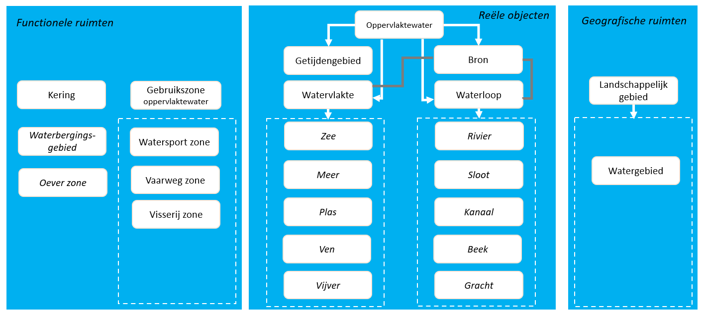
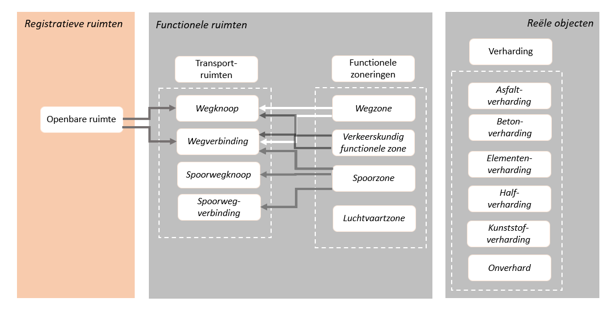

## Samenhang

### Kaders conceptueel model

In het conceptueel model voor de samenhangende objectenregistratie wordt zoveel mogelijk gebruik gemaakt van terminologie die aansluit op de wijze waarop hiermee wordt omgegaan in het hier relevante afsprakenstelsel voor informatiemodellering. Het gaat daarbij onder meer om het Metamodel Informatiemodellering (MIM) ), NEN 2660 (Ordeningsregels voor gegevens in de bouw – Termen, definities en algemene regels) en waar mogelijk de Nederlandse Technische Afspraak (NTA) 8035 over semantische Gegevensmodellering en -Integratie in de Gebouwde Omgeving. Dit betekent onder meer dat er wordt gesproken over objecttypen en de eigenschappen daarvan in plaats van over objecten en gegevens. De termen objecten en gegevens worden gebruikt om specifieke exemplaren van objecttypen en eigenschappen aan te duiden.

Het conceptueel model voor de samenhangende objectenregistratie is daarnaast zodanig opgesteld dat deze zo volledig mogelijk aansluit op de nieuwe versie van het basismodel geo-informatie (“NEN 3610”). Dit basismodel geo-informatie wordt namelijk tegelijkertijd met het opstellen van het conceptueel model voor de samenhangende objectenregistratie vernieuwd. Hiermee ontstaat de mogelijkheid om begrippen in beide modellen over en weer zoveel mogelijk op elkaar af te stemmen. De resultaten van deze afstemming zijn verwerkt in de volgende hoofdstukken. Bij de afronding van beide modellen zal blijvende afstemming worden bewaakt. Dat kan betekenen dat in beide modellen in een latere fase nog kleine wijzigingen zullen worden aangebracht.

In de volgende hoofdstukken is daarom telkens aangegeven hoe SOR-begrippen zich verhouden tot de semantische hoofdklassen uit het vernieuwde basismodel geo-informatie. In enkele gevallen betekent dit dat de SOR-begrippen hetzelfde zijn als de semantische hoofdklassen uit het vernieuwde basismodel geo-informatie. In andere gevallen zijn de SOR-begrippen een verbijzondering van deze semantische hoofdklassen. Hierbij is uitgegaan van de versie van het nieuwe basismodel geo-informatie zoals deze in januari 2021 beschikbaar was. Daarin is het volgende semantische model opgenomen:
 

De verschillende in dit semantische model opgenomen hoofdklassen worden daarbij als volgt gedefinieerd:

| Begrip  | Definitie  |
|---|---|
|Geo-object| Abstractie van een fenomeen in de werkelijkheid, dat direct of indirect is geassocieerd met een locatie relatief ten opzichte van de aarde|
|**Reëel object**|	Geo-object waarvan het fenomeen in de werkelijkheid tastbaar, zichtbaar en begrensd aanwezig is|
|Bodem|	Bovenste deel van het natuurlijke aardoppervlak|
|Water|	Oppervlak permanent bedekt met water of waarvan wordt geaccepteerd dat deze met water bedekt kan worden|
|Begroeiing|	Planten die op natuurlijke wijze zijn ontstaan of door mensen zijn aangeplant|
|Constructie|	Gebouwd object dat direct of indirect met de grond is verbonden en bedoeld is om ter plaatse te functioneren|
|Gebouw|	Overdekte en geheel of gedeeltelijk met wanden omsloten constructief zelfstandige eenheid bedoeld voor het in een afgeschermde omgeving onderbrengen van mensen, dieren of voorwerpen of voor de productie van goederen|
|Kunstwerk|	Civiel-technisch werk voor de infrastructuur van wegen, water, spoorbanen, waterkeringen en/of leidingen|
|Verharding|	Een door egaliseren, verstevigen en/of verruwen voor het beoogde gebruik geschikt gemaakte oppervlak, bestaande uit in één of meer lagen over een ondergrond of onderliggende constructie aangelegd materiaal|
|Leiding|	Een geheel van geleiders of ruimte welke voorzien zijn van één ommanteling en bestemd is voor transport van materie, data of energie|
|**Virtuele ruimte**|	Geo-object waarvan geen tastbaar, zichtbaar en begrensd fenomeen in de werkelijkheid aanwezig is, maar die slechts in abstracte en/of geregistreerde vorm bestaat|
|Functionele ruimte|	Ruimte met een specifieke functie|
|Transportruimte|	Natuurlijke of aangelegde transportlijnen of verbindingen met knooppunten waarlangs stromen zich kunnen verplaatsen|
|Verkeerruimte| Verkeerruimte voor verkeer over land, water of door de lucht|
|Wegverkeerruimte|	Verkeerruimte voor voertuigen die zich over wegen verplaatsen|
|Scheepvaartruimte|	Verkeerruimte voor voertuigen die zich over water verplaatsen|
|Spoorverkeerruimte|	Verkeerruimte voor voertuigen die zich over rails verplaatsen|
|Waterverplaatsingsruimte	|Transportruimte waardoor water zich verplaatst|
|Registratieve ruimte|	Op basis van wet- of regelgeving afgebakende ruimte die als eenheid geldt van politiek/bestuurlijke verantwoordelijkheid of voor bedrijfsvoering|
|Geografische ruimte|	Ruimte die bekend staat onder een vanuit de historie of in in de volksmond bekende benaming of een fysisch-geografische samenhang kent|
|Juridische ruimte| Ruimte waar een juridisch instrument beleid of regelgeving toepast|

### Ordening SOR-begrippen

In het hoofdlijnenrapport inhoud samenhangende objectenregistratie (https://docs.geostandaarden.nl/disgeo/hiso/) is het conceptueel denkraam voor de inhoud van de samenhangende objectenregistratie opgenomen. Het daarin geïntroduceerde begrippenkader wordt in dit conceptueel model verder uitgewerkt langs de hiervoor beschreven ordening van semantische hoofdklassen in NEN 3610. Dat betekent dat er in de inhoud van de SOR een onderscheid wordt gemaakt tussen reële objecten (voorheen fysieke objecttypen), functionele ruimten (voorheen functionele objecttypen), registratieve ruimten (voorheen registratieve objecttypen). Bij de verdere uitwerking van de inhoud is geconstateerd dat daaraan nog een aantal geografische ruimten moeten worden toegevoegd.

Hierbij zijn de verschillende begrippen die binnen de samenhangende objectenregistratie zullen worden onderscheiden geordend naar de verschillende semantische hoofdklassen in NEN 3610. Deze begrippen zijn in de hierna volgende hoofdstukken verder uitgewerkt. Het gaat daarbij om een aanzienlijk aantal begrippen, waarvan een aantal ten behoeve van de overzichtelijkheid zijn samengevoegd onder een verzamelbegrip (zie verder paragraaf [Beschrijvingswijze](#beschrijvingswijze)). Deze begrippen kunnen (deels geaggregeerd) ook worden geplaatst binnen het eerder opgestelde conceptueel denkraam. De indeling in de vier kleurgroepen (bebouwing, water, groen en verharding) is hierbij uitsluitend bedoeld als een praktisch hulpmiddel om de verschillende begrippen in de SOR snel te kunnen plaatsen en niet als een overzicht voor de ordening van begrippen in relatie tot NEN 3610.  Hierbij ontstaat de volgende geactualiseerde versie van het conceptueel denkraam:

. 

.
  

Relaties tussen de verschillende soorten objecten in de SOR kunnen op twee manieren worden gelegd: 
- Een relatie kan gelegd worden door expliciet te beschrijven dat een object zich op een bepaalde wijze verhoudt tot een ander object. Hierbij kan worden gedacht aan relaties als “ligt in” of “hoort bij”. Dit type relatie zal alleen worden gelegd tussen objecten die een logische samenhang hebben. Een voorbeeld hiervan is de relatie tussen een openbare ruimte en het wegennetwerk; op deze manier kan aangegeven worden wat de straatnaam is van een wegverbinding.
- Een relatie kan ook gelegd worden op basis van geometrische eigenschappen van objecten. In dat geval worden relaties gelegd door ruimtelijk gerelateerde objecten geometrisch te combineren bij de het genereren van een informatieproduct op basis van de SOR of door een eindgebruiker zelf.

Het conceptueel model zal, voor die onderdelen van het model waar sprake is van een expliciete samenhang tussen verschillende begrippen, een beschrijving geven van de relaties die er bestaan met andere begrippen. Hiermee ontstaat de mogelijkheid om objecten binnen de SOR aan elkaar te relateren of deze objecten te relateren aan objecten buiten de SOR. In onderstaande schema's is daarvoor aangegeven hoe de verschillende begrippen globaal aan elkaar gerelateerd zijn.

De samenhang rond gebouwen:

De samenhang rond groen:

De samenhang rond water:

De samenhang rond verharding en netwerken:

De samenhang rond kunstwerken:

De samenhang rond overige constructies:

De samenhang rond registratieve ruimten en sommige geografische ruimten

### Aansluiting sectormodellen

Dit conceptueel model beschrijft de inhoud van de samenhangende objectenregistratie. In die registratie wordt niet meer detail opgenomen dan nodig, zijn begrippen opgenomen die herkenbaar zijn voor niet-gespecialiseerde gebruikers en die eenvoudig zijn vast te stellen door de bronhouders. Het gaat bovendien om begrippen die van belang zijn voor meerdere domeinen van overheidshandelen. Domeinen moeten daarbij ruim worden opgevat. Het kan zowel gaan om domeinen van bedrijfsvoering (zoals belastingen, beheer openbare ruimte en ruimtelijke ordening) als van specifieke ruimtelijke objecten (zoals water, gebouwen of ondergrond). 

Binnen deze domeinen worden naast algemene begrippen vaak tal van voor dat domein specifieke begrippen gehanteerd. Veel van deze begrippen zijn vastgelegd in sectorale informatiemodellen of gegevenswoordenboeken. Zo biedt IMBOR (Informatiemodel Beheer Openbare Ruimte) overheden en andere terreinbeheerders een standaard voor het vastleggen van areaal- en objectgegevens die noodzakelijk zijn voor assetmanagement. AQUO is een voorbeeld van een semantische standaard waarin de betekenis van begrippen en gegevens en hun onderlinge relaties zijn gedefinieerd en die zich richt op het uitwisselen van gegevens binnen de watersector. Het is belangrijk dat het conceptueel model (en op een later moment ook het informatiemodel) van de samenhangende objectenregistratie goed aansluit op dergelijke sectormodellen. Deze aansluiting kan betekenen dat een sectormodel een uitbreiding biedt van geregistreerde eigenschappen over hetzelfde object in de SOR en de sectorale registratie of het kan betekenen dat de sectorregistratie een nadere verbijzondering aanbrengt binnen een in de SOR opgenomen object. Daarnaast zullen in sectormodellen ook begrippen zijn opgenomen die specifiek zijn voor een sector en geen expliciete relatie hebben met in de SOR opgenomen begrippen.

*Meer gegevens over hetzelfde object*

De grondgedachte is dat in de SOR objecten eenduidig worden afgebakend en geregistreerd die van belang zijn voor gebruik in andere registraties in verschillende overheidsdomeinen. Omdat dezelfde objecten die in de SOR worden geregistreerd ook worden gebruikt in deze andere registraties, vervult de SOR dus vooral een brugfunctie tussen de verschillende registraties waardoor het mogelijk wordt gegevens over een object integraal te kunnen gebruiken. De eigenschappen van deze in de SOR afgebakende objecten worden nadrukkelijk niet allemaal in de SOR opgenomen. Deze blijven voornamelijk geregistreerd worden in verschillende sectorregistraties en lokale registraties.

In de informatiemodellen voor deze sectorregistraties zullen dus (gedeeltelijk) dezelfde objecttypen voorkomen die ook zijn opgenomen in de SOR. In het informatiemodel van de sectorregistratie is bij deze objecttypen dan ook uitsluitend vastgelegd wat er aanvullend op de reeds in de SOR opgenomen eigenschappen van deze objecten wordt vastgelegd. In de aan de gebruikers te leveren informatieproducten kunnen daarbij alle eigenschappen van een object worden getoond door het combineren van de gegevens uit zowel de SOR als de sectorregistratie (zie paragraaf [Model van begrippen en informatieproducten](#model-van-begrippen-en-informatieproducten)).

<aside class='example'>
 Bomen zullen (onder bepaalde nog uit te werken voorwaarden) in de SOR worden opgenomen. Hiervan zal in de SOR uitsluitend de ligging worden vastgelegd. Voor het beheren van de openbare ruimte is echter de vastlegging van meerdere gegevens gewenst. Deze zijn beschreven in IMBOR. Als vast te leggen eigenschappen zijn daarbij onder meer de soortnaam, de groeifase en de stamdiameter gedefinieerd. Deze aanvullend op de in de SOR opgenomen gegevens over een boom kunnen in een registratie voor groenbeheer worden vastgelegd. Daarbij wordt er dan in de groenregistratie een verwijzing aangebracht (door middel van een unieke identificatiecode) naar een in de SOR opgenomen boom. 
 
 In de SOR zullen toegangsdeuren tot gebouwen worden opgenomen. Van deze toegangsdeuren zullen slechts een beperkt aantal eigenschappen worden bijgehouden, zoals de ligging van de deur, de plaats waarvan een toegangsdeur toegang geeft en de aard van gebruik van een toegangsdeur. In hoeverre een toegangsdeur voor hulpverleners is te gebruiken in het geval van de ontruiming van een gebouw is een gegeven dat niet in de SOR zal worden opgenomen. Als hieraan behoefte bestaat bij bijvoorbeeld de Brandweer dan zal dit aanvullend op de SOR in een eigen registratie moeten worden opgenomen.

</aside>

*Nadere detaillering van een object*

Voor de nadere detaillering van objecten is als grondgedachte gehanteerd dat gestreefd moet worden naar de realisatie van een “uitklapmodel”. Hiermee wordt bedoeld dat in de samenhangende objectenregistratie begrippen op een zodanig abstractieniveau worden opgenomen dat zij weliswaar voldoende concreet zijn om in de uitvoeringspraktijk herkenbaar te zijn, maar dat zij niet zo concreet zijn dat er sprake is van een mate van detail die passender is voor de opname in een sectorale registratie. De in de samenhangende objectenregistratie opgenomen begrippen moeten daarbij kunnen fungeren als een verzamelklasse van begrippen die in een sectoraal model zijn opgenomen. Bij begrippen kan het daarbij zowel gaan om objecttypen als om eigenschappen van objecttypen.

<aside class='example'>
 In de samenhangende objectenregistratie wordt opgenomen dat het “type verharding” van een verhardingsobject de waarde “betonverharding” kan aannemen. In het informatiemodel voor het beheren van de openbare ruimte (IMBOR) is opgenomen dat deze typering van betonverharding nader kan worden verfijnd in onder meer “Ongewapend verdeuveld beton” en “Gewapend beton”. Deze typeringen sluiten als een “uitklapmodel” op elkaar aan. Als in een lokale wegbeheer-registratie een verharding is opgenomen van het type “Gewapend beton”, zal deze verharding in de samenhangende objectenregistratie worden aangetroffen als een verharding van een type “betonverharding”.
</aside>

Het uitklapmodel borgt dus de koppeling van de SOR met de sectorregistratie. Ook hier kunnen in de aan de gebruikers te leveren informatieproducten zowel de uitgeklapte als de niet-uitgeklapte gegevens in samenhang worden getoond door het combineren van de gegevens uit zowel de SOR als de sectorregistratie (zie paragraaf [Model van begrippen en informatieproducten](#model-van-begrippen-en-informatieproducten)). Hierdoor is het op termijn ook niet meer nodig om het nu bestaande (technische) berichtenverkeer tussen de SOR en de sectorregistratie toe te passen, maar kan deze worden vervangen door een andere werkwijze.

*Gevolgen*

Het is dus belangrijk dat de verschillende sectorale informatiemodellen zoveel mogelijk aangesloten kunnen worden op het informatiemodel van de SOR. Bij het opstellen van het conceptueel informatiemodel is daarom zoveel mogelijk beoordeeld in hoeverre een dergelijke aansluiting te realiseren is. Soms betekent dat een aanpassing van begrippen zoals deze in de huidige basisregistraties voorkomen, soms zal dit betekenen dat op termijn aanpassingen in de sectormodellen of de SOR doorgevoerd moeten worden.

Deze benadering betekent ook dat ervoor is gekozen om in de eerste opzet van het conceptueel model een aantal gedetailleerde objecttypen of typeringen van objecttypen niet langer als zodanig op te nemen. Deze begrippen zijn dan samengevoegd tot een minder gedetailleerd begrip dat weliswaar nog steeds de essentie aangeeft van het betreffende object, maar dat een mindere mate van detaillering geeft dan in de huidige registratie. Het gaat hierbij overigens veelal om begrippen die in de huidige uitvoeringspraktijk niet of slechts zeer beperkt worden toegepast. 

Indien het gewenst is wel gedetailleerde informatie over deze objecten te verkrijgen, zal deze moeten worden afgenomen vanuit een sectorale registratie (indien aanwezig). Als voorbeeld kan worden gedacht aan een registratie van brandkranen door de brandweer. De noodzaak tot het ophalen van gegevens uit sectorale registraties, geldt ook voor meer specifieke gegevens over bepaalde soorten objecten. Zo zijn in het Antenneregister meer gegevens opgenomen over vast opgestelde antenne-installaties met een zendvermogen groter dan 10 decibelwatt dan dat er ooit in een basisregistratie beschikbaar zullen worden gesteld.

### Beschrijvingswijze

*SOR begrippen*

In deze fase van conceptuele modellering is de focus gericht op het scherp benoemen van begrippen die we in het kader van de registratie willen hanteren. Van de begrippen die betrekking hebben op objecten zal een aantal daarvan in een volgende fase ook daadwerkelijk in het informatiemodel worden opgenomen als een objecttype. Van een groot aantal andere begrippen zal waarschijnlijk worden vastgesteld dat in de modellering beter gekozen kan worden voor een verzamel-objecttype waarvan de verschillende begrippen in de vorm van een typering van dit verzamel-objecttype terugkeren. In dit conceptueel model wordt daarom gesproken over SOR-begrippen en nog niet van SOR-objecttypen.  Deze SOR-begrippen zouden hierna als een lange lijst kunnen worden opgenomen. Om de overzichtelijkheid te bevorderen en de samenhang tussen de verschillende begrippen beter duidelijk te maken, is ervoor gekozen om in de volgende hoofdstukken de SOR-begrippen op één van de volgende twee wijzen te beschrijven:

- In de vorm van een omschrijving die sterk aansluit op de omschrijving die in het vervolg van het traject voor objecttypen zal worden opgesteld. Dit betekent onder meer dat bij deze SOR-begrippen is aangegeven welke eigenschappen van belang zijn en welke waarden deze eigenschappen kunnen aannemen. Deze wijze van beschrijving is vooral gekozen voor SOR-begrippen waarvan in de bestaande basisregistraties reeds verschillende eigenschappen zijn opgenomen.
- In de vorm van een typering van een meer generiek begrip dat is omschreven op een wijze zoals ook objecttypen zullen worden beschreven. In dat geval fungeert het verzamelbegrip in deze fase vooral als een kapstok om verschillende SOR-begrippen enigszins te ordenen. De SOR-begrippen zelf staan dan genoemd als de verschillende waarden die de eigenschap typering van het verzamelbegrip kan aannemen.

Deze wijze van beschrijven betekent dus niet dat de nu opgenomen ordening van SOR-begrippen ook automatisch leidt tot de opgenomen verdeling in objecttypen en typeringen van verzamel-objecttypen. Deze keuze zal in de volgende fase van modellering worden gemaakt op basis van andere criteria (zoals de mate waarin de eigenschappen van verschillende SOR-begrippen ook daadwerkelijk overeen komen en de uiteindelijke besluiten die er worden genomen over de begrippen en eigenschappen die in de registratie zullen worden bijgehouden).

*Beschrijvingswijze*

Bij de uitwerking van de verschillende SOR-begrippen of verzamelbegrippen wordt telkens dezelfde structuur gehanteerd. De eerste stap hierbij is dat het begrip wordt gepositioneerd ten opzichte van de hoofdklasse zoals deze in het kader van het voorstel voor de nieuwe versie van het basismodel geo-informatie (“NEN 3610”) wordt gehanteerd. Hiermee wordt verhelderd hoe het begrip past in een bredere context.

In het eerste blok wordt het betreffende SOR-begrip of verzamelbegrip gedefinieerd.  Hierbij wordt zoveel mogelijk aangesloten op bestaande definities. Soms moeten definities worden aangescherpt omdat deze onvoldoende onderscheidend zijn of omdat door de striktere scheiding tussen reële objecttypen en functionele objecttypen de definitie niet langer voldoet. De bron van de definitie wordt vermeld (voor zover deze beschikbaar is). Ook wordt zo nodig een toelichting gegeven en wordt indicatief beschreven hoe de objecten zich verhouden tot afbakeningen zoals deze momenteel in registraties zijn opgenomen. De opgenomen eerste indicatie van de mate waarin bepaalde SOR-begrippen verplicht in de registratie zullen worden vastgelegd, betreft een expert-inschatting. Hierover zal nog nadere besluitvorming moeten plaatsvinden.

In het tweede blok wordt een overzicht gegeven van de verschillende eigenschappen die van een object zouden moeten worden vastgelegd. Een aantal eigenschappen keren bij alle beschreven SOR-begrippen terug (identificatie, geometrie en status). In het hoofdstuk [Generieke onderwerpen](#generieke-onderwerpen) is in algemene zin al ingegaan op deze eigenschappen. Voor verschillende SOR-begrippen is ook een voorstel opgenomen voor de vastlegging van andere eigenschappen.  De opgenomen eerste indicatie van de mate waarin bepaalde eigenschappen verplicht in de registratie zullen worden vastgelegd, betreft een expert-inschatting. Hierover zal nog nadere besluitvorming moeten plaatsvinden.

Bij sommige SOR-begrippen is een blok “relaties met andere objecttypen” opgenomen. Daarin wordt beschreven als een SOR-begrip zich expliciet verhoudt tot een ander SOR-begrip. Hierbij kan worden gedacht aan relaties als “ligt in” of “hoort bij”. Deze relaties zullen in een volgende fase nog verder worden gedetailleerd. Als dit blokje niet is opgenomen, dan zijn er op dit moment geen expliciete relaties gedefinieerd.

Het laatste blok beschrijft een eerste overzicht van de domeinwaarden zoals deze behoren bij bepaalde eigenschappen. In alle gevallen is hier een verwijzing naar de domeinwaarden van “status” opgenomen. In een groot aantal andere gevallen zijn daarnaast domeinwaarden voor de typering van SOR-begrippen opgenomen. Typeringen staan alfabetisch gerangschikt (met uitzondeing van wegtyperingen), er is geen hiërarchie in objecten en domeinwaarden (zoals voorheen in de BGT).

