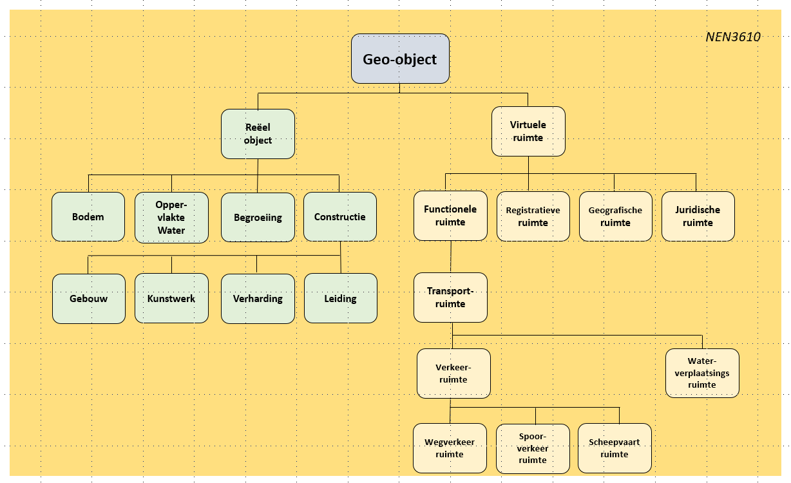
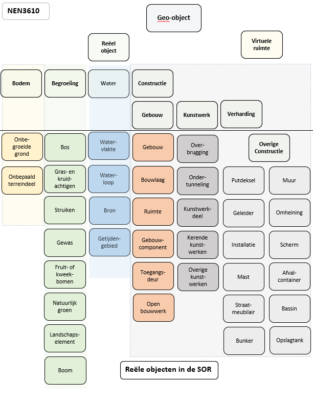
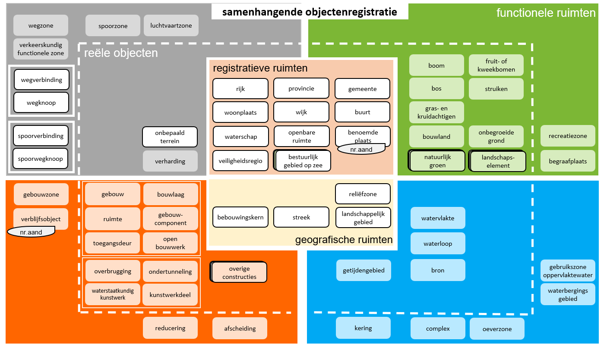

## Schets samenhang

### SOR-begrippen, objecttypen, en typeringen

In het informatiemodel voor de samenhangende objectenregistratie wordt zoveel mogelijk gebruik gemaakt van terminologie die aansluit op de wijze waarop hiermee wordt omgegaan in de hier relevante afsprakenstelsel voor informatiemodellering. Het gaat daarbij onder meer om het Metamodel Informatiemodellering (MIM) en de Nederlandse Technische Afspraak (NTA) 8035 over semantische Gegevensmodellering en -Integratie in de Gebouwde Omgeving. Dit betekent onder meer dat er wordt gesproken over objecttypen en de eigenschappen daarvan in plaats van over objecten en gegevens. De termen objecten en gegevens worden gebruikt om specifieke exemplaren van objecttypen en eigenschappen aan te duiden.

In deze fase van conceptuele modellering is het van belang dat de focus is gericht op het scherp benoemen van begrippen die we in het kader van de registratie willen hanteren. Van de begrippen die betrekking hebben op objecten zal een aantal daarvan in een volgende fase ook daadwerkelijk in het informatiemodel worden opgenomen als een objecttype. Van een groot aantal andere begrippen zal waarschijnlijk worden vastgesteld dat in de modellering beter gekozen kan worden voor een verzamel-objecttype waarvan de verschillende begrippen in de vorm van een typering van dit verzamel-objecttype terugkeren. In deze fase is het daarom ten aanzien van objecten wenselijk vooralsnog te spreken van SOR-begrippen en nog niet van SOR-objecttypen. In de volgende hoofdstukken wordt daarom gesproken van SOR-begrippen.

Het is voor de overzichtelijkheid echter ook niet wenselijk om in deze fase te volstaan met het uitsluitend opnemen van een lange lijst met relevante SOR-begrippen. Enige ordening daarin bevordert het overzicht en stelt anderen in staat om de samenhang tussen de verschillende begrippen beter te beoordelen. Om die reden is ervoor gekozen om in de volgende hoofdstukken de SOR-begrippen op één van de volgende twee wijzen te beschrijven:

-   In de vorm van een omschrijving die sterk aansluit op de omschrijving die in het vervolg voor objecttypen zal worden opgesteld. Dit betekent onder meer dat bij deze SOR-begrippen is aangegeven welke eigenschappen van belang zijn en welke waarden deze eigenschappen kunnen aannemen. Deze wijze van beschrijving is vooral gekozen voor SOR-begrippen waarvan in de bestaande basisregistraties reeds verschillende eigenschappen zijn opgenomen.
-   In de vorm van een typering van een meer generiek begrip dat is omschreven op een wijze als objecttypen zullen worden beschreven. In dat geval fungeert het “verzamel-objecttype” in deze fase met name als een kapstok om verschillende SOR-begrippen enigszins te ordenen. De SOR-begrippen zelf staan dan genoemd als de verschillende waarden die de eigenschap typering van het “verzamel-objecttype” kan aannemen.

Benadrukt wordt dat deze wijze van beschrijven niet betekent dat de nu opgenomen ordening van SOR-begrippen ook daadwerkelijk leidt tot de opgenomen verdeling in objecttypen en typeringen van verzamel-objecttypen. Deze keuze zal in de volgende fase van modellering worden gemaakt op basis van andere criteria (zoals de mate waarin de eigenschappen van verschillende SOR-begrippen ook daadwerkelijk overeen komen en de uiteindelijke keuzen ten aanzien van welke eigenschappen in de registratie zullen worden bijgehouden).

### Nieuwe versie van NEN 3610 als kader

Het informatiemodel voor de samenhangende objectenregistratie zal zodanig worden opgesteld dat deze volledig aansluit op de nieuwe versie van het basismodel geo-informatie (“NEN 3610”). Dit basismodel geo-informatie wordt namelijk tegelijkertijd met het opstellen van het informatiemodel voor de samenhangende objectenregistratie vernieuwd. Hiermee ontstaat de mogelijkheid om begrippen in beide modellen over en weer zoveel mogelijk op elkaar af te stemmen. De resultaten van deze afstemming zijn verwerkt in de volgende hoofdstukken. Bij de afronding van beide modellen zal blijvende afstemming worden bewaakt. Dat kan betekenen dat in beide modellen in een latere fase nog kleine wijzigingen zullen worden aangebracht.

In de volgende hoofdstukken is daarom telkens aangegeven hoe SOR-begrippen zich verhouden tot objectentypen uit het vernieuwde basismodel geo-informatie. In enkele gevallen betekent dit dat de SOR-begrippen hetzelfde zijn als objecttypen uit het vernieuwde basismodel geo-informatie. In andere gevallen zijn de SOR-begrippen een verbijzondering van objecttypen uit het vernieuwde basismodel geo-informatie. Hierbij is uitgegaan van de versie van het nieuwe basismodel geo-informatie zoals deze in juli 2020 beschikbaar was. Daarin wordt het volgende semantische model onderscheiden:
 

  

| Begrip  | Definitie  |
|---|---|
|Geo-object| Abstractie van een fenomeen in de werkelijkheid, dat direct of indirect is geassocieerd met een locatie relatief ten opzichte van de aarde|
|**Reëel object**|	Geo-object waarvan het fenomeen in de werkelijkheid tastbaar, zichtbaar en begrensd aanwezig is|
|Bodem|	Bovenste deel van het natuurlijke aardoppervlak|
|Water|	Oppervlak permanent bedekt met water of waarvan wordt geaccepteerd dat deze met water bedekt kan worden|
|Begroeiing|	Planten die op natuurlijke wijze zijn ontstaan of door mensen zijn aangeplant|
|Constructie|	Gebouwd object dat direct of indirect met de grond is verbonden en bedoeld is om ter plaatse te functioneren|
|Gebouw|	Overdekte en geheel of gedeeltelijk met wanden omsloten constructief zelfstandige eenheid bedoeld voor het in een afgeschermde omgeving onderbrengen van mensen, dieren of voorwerpen of voor de productie van goederen|
|Kunstwerk|	Civiel-technisch werk voor de infrastructuur van wegen, water, spoorbanen, waterkeringen en/of leidingen|
|Verharding|	Een door egaliseren, verstevigen en/of verruwen voor het beoogde gebruik geschikt gemaakte oppervlak, bestaande uit in één of meer lagen over een ondergrond of onderliggende constructie aangelegd materiaal|
|Leiding|	Een geheel van geleiders of ruimte welke voorzien zijn van één ommanteling en bestemd is voor transport van materie, data of energie|
|**Virtuele ruimte**|	Geo-object waarvan geen tastbaar, zichtbaar en begrensd fenomeen in de werkelijkheid aanwezig is, maar die slechts in abstracte en/of geregistreerde vorm bestaat|
|Functionele ruimte|	Ruimte met een specifieke functie|
|Transportruimte|	Natuurlijke of aangelegde transportlijnen of verbindingen met knooppunten waarlangs stromen zich verplaatsen|
|Wegverkeerruimte|	Transportruimte voor voertuigen die zich over wegen verplaatsen|
|Scheepvaartruimte|	Transportruimte voor voertuigen die zich over water verplaatsen|
|Spoorverkeerruimte|	Transportruimte voor voertuigen die zich over rails verplaatsen|
|Waterruimte	|Transportruimte waardoor water zich verplaatst|
|Registratieve ruimte|	Op basis van wet- of regelgeving afgebakende ruimte die als eenheid geldt van politiek/bestuurlijke verantwoordelijkheid of voor bedrijfsvoering|
|Geografische ruimte|	Ruimte die bekend staat onder een vanuit de historie of in in de volksmond bekende benaming of een fysisch-geografische samenhang kent|
|Juridische ruimte| Gebied waar een juridisch instrument beleid of regelgeving toepast|

### Aansluiting sectormodellen

Het is belangrijk dat de verschillende sectorale informatiemodellen zoveel mogelijk aangesloten kunnen worden op het informatiemodel van de samenhangende objectenregistratie. Bij het opstellen van het conceptueel informatiemodel is daarom zoveel mogelijk beoordeeld in hoeverre een dergelijke aansluiting te realiseren is. Soms betekent dat een aanpassing van begrippen zoals deze in de huidige basisregistraties voorkomen, soms zal dit betekenen dat op termijn aanpassingen in de sectormodellen doorgevoerd moeten worden.

Hierbij is als grondgedachte gehanteerd dat gestreefd moet worden naar een “uitklapmodel”. Hiermee wordt bedoeld dat in de samenhangende objectenregistratie begrippen op een zodanig abstractieniveau worden opgenomen dat zij weliswaar voldoende concreet zijn om in de uitvoeringspraktijk herkenbaar te zijn, maar dat zij niet zo concreet zijn dat er sprake is van een mate van detail die passender is voor de opname in een sectorale registratie. De in de samenhangende objectenregistratie opgenomen begrippen moeten daarbij kunnen fungeren als een verzamelklasse van begrippen die in een sectoraal model zijn opgenomen. Bij begrippen kan het daarbij zowel gaan om objecttypen als om typeringen van objecttypen.

<aside class='example'>
 In de samenhangende objectenregistratie wordt opgenomen dat het “type verharding” van een verhardingsobject de waarde “betonverharding” kan aannemen. In het informatiemodel voor het beheren van de openbare ruimte (IMBOR) is opgenomen dat deze typering van betonverharding nader kan worden verfijnd in onder meer “Ongewapend verdeuveld beton “ en “Gewapend beton”. Deze typeringen sluiten als een “uitklapmodel” op elkaar aan. Als in een lokale wegbeheer-registratie een verharding is opgenomen van het type “Gewapend beton”, zal deze verharding in de samenhangende objectenregistratie worden aangetroffen als een verharding van een type “betonverharding”.
</aside>

Deze benadering betekent ook dat ervoor is gekozen om in de eerste opzet van het conceptueel model een aantal gedetailleerde objecttypen of typeringen van objecttypen niet langer als zodanig op te nemen. Deze begrippen zijn dan samengevoegd tot een minder gedetailleerd begrip dat weliswaar nog steeds de essentie aangeeft van het betreffende object, maar dat een mindere mate van detaillering geeft dan in de huidige registratie. Het gaat hierbij overigens veelal om begrippen die in de huidige uitvoeringspraktijk niet of slechts zeer beperkt worden toegepast. Indien het gewenst is wel gedetailleerde informatie over deze objecten te verkrijgen, zal deze moeten worden afgenomen vanuit een sectorale registratie (indien aanwezig).

### Overzicht van de SOR-begrippen

In aansluiting op de voorgestelde ordening van objecttypen in NEN 3610 en het eerder opgestelde conceptueel denkraam, wordt in de inhoud van de SOR een onderscheid gemaakt tussen reële objecttypen (voorheen fysieke objecttypen) en virtuele objecttypen (waaronder de functionele objecttypen en de registratieve objecttypen). Bij de verdere uitwerking van de inhoud is geconstateerd dat daaraan nog een aantal geografische objecttypen moeten worden toegevoegd. Alle hierbij behorende SOR-begrippen zijn in de hierna volgende hoofdstukken verder uitgewerkt. Het gaat daarbij om een aanzienlijk aantal begrippen.

Om enige ordening aan te brengen in de verschillende SOR-begrippen, zijn deze (in geaggregeerde vorm) opgenomen in het eerder opgestelde conceptueel denkraam. Hierbij ontstaat de volgende geactualiseerde versie van het conceptueel denkraam:

Dit denkraam geeft dus geen volledig overzicht van alle SOR-begrippen. De indeling in de vier kleurgroepen (bebouwing, water, groen en verharding) is geen onderdeel van het uiteindelijke informatiemodel, maar uitsluitend bedoeld als een hulpmiddel om de verschillende begrippen te kunnen ordenen en ten opzichte van elkaar te kunnen plaatsen.

Het conceptueel denkraam kan, voor die onderdelen van het model waar sprake is van een expliciete samenhang tussen verschillende begrippen, verder worden geconcretiseerd. Daar waar dit wenselijk is kan dit plaatsvinden bij de verdere uitwerking van het conceptueel model. Op dit moment is in elk geval een dergelijke uitwerking beschikbaar voor de verschillende begrippen die raken aan gebouwen: 

###	Beschrijving SOR-begrippen

Bij de uitwerking van de verschillende SOR-begrippen of verzamelbegrippen wordt telkens dezelfde structuur gehanteerd. De eerste stap hierbij is dat het begrip wordt gepositioneerd ten opzichte van de objectklasse zoals deze in het kader van het voorstel voor de nieuwe versie van het basismodel geo-informatie (“NEN 3610”) wordt gehanteerd. Hiermee wordt verhelderd hoe het begrip past in een bredere context.

In het tweede blok wordt het betreffende SOR-begrip of verzamelbegrip gedefinieerd. Hierbij wordt zoveel mogelijk aangesloten op bestaande definities. Soms moeten definities worden aangescherpt omdat deze onvoldoende onderscheidend zijn of omdat door de striktere scheiding tussen reële objecttypen en functionele objecttypen de definitie niet langer voldoet. De bron van de definitie wordt vermeld (voor zover deze beschikbaar is). Ook wordt zo nodig een toelichting gegeven en wordt indicatief beschreven hoe de objecten zich verhouden tot afbakeningen zoals deze  momenteel in registraties zijn opgenomen. 

    De opgenomen eerste indicatie van de mate waarin bepaalde SOR-begrippen verplicht in de registratie zullen worden vastgelegd, betreft een expert-inschatting. Hierover zal nog nadere besluitvorming moeten plaatsvinden.

In het derde blokje wordt een overzicht gegeven van de verschillende eigenschappen die van een object zouden moeten worden vastgelegd. Een aantal eigenschappen keren bij alle beschreven SOR-begrippen terug (zoals identificatie, geometrie, status en overige metagegevens). Voor verschillende SOR-begrippen is ook een voorstel opgenomen voor de vastlegging van andere eigenschappen. De overige meta-gegevens zijn op dit moment nog nergens opgenomen. Deze zullen in een volgende fase verder worden uitgewerkt.

     De opgenomen eerste indicatie van de mate waarin bepaalde eigenschappen verplicht in de registratie zullen worden vastgelegd, betreft een expert-inschatting. Hierover zal nog nadere besluitvorming moeten plaatsvinden.

Bij sommige SOR-begrippen is een blokje “relaties met andere objecttypen” opgenomen. Daarin wordt expliciet beschreven hoe een SOR-begrip zich verhoudt tot een ander SOR-begrip. Hierbij kan worden gedacht aan relaties als “ligt in” of “hoort bij”. Deze relaties zullen in een volgende fase nog verder worden gedetailleerd. Als dit blokje niet is opgenomen, dan zijn er op dit moment geen expliciete relaties gedefinieerd.

Het laatste blokje beschrijft een eerste overzicht van de domeinwaarden zoals deze behoren bij bepaalde eigenschappen. In alle gevallen is hier een voorstel voor de domeinwaarden van “status” opgenomen. In een groot aantal andere gevallen zijn daarnaast domeinwaarden voor de typering van SOR-begrippen opgenomen.
